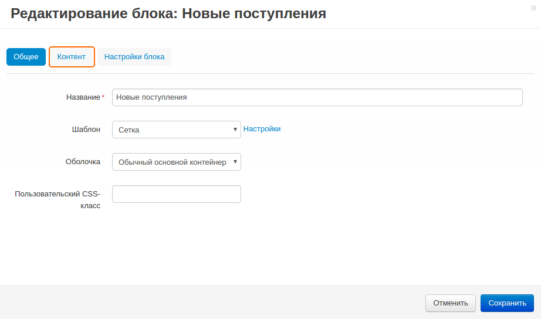
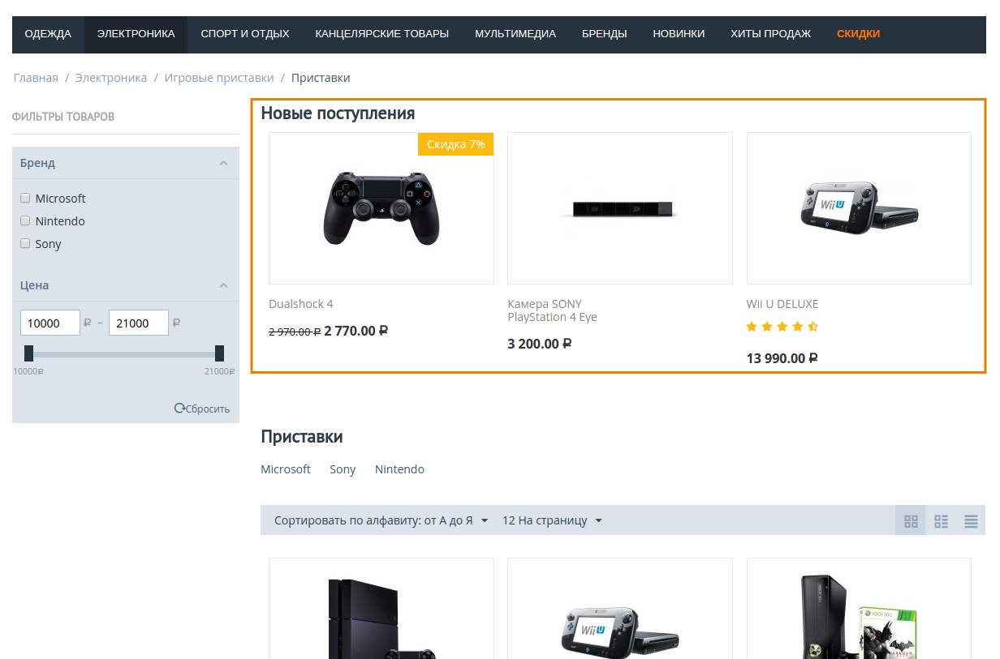

************************************************************
Как вывести блок с новыми поступлениями на страницы магазина
************************************************************

=======================================================
Как вывести блок с новыми поступлениями на все страницы
=======================================================

Для отображения блока с новыми поступлениями на всех страницах магазина, выполните следующие шаги:

1. В панели администратора откройте **Дизайн → Макеты** и перейдите на вкладку **По умолчанию**.

2. Щёлкните **+** на контейнере, в котором будет располагаться блок и выберите вкладку **Добавить блок**.

3. Переключитесь на вкладку **Создать новый блок** и в списке выберите тип контейнера **Товары**.

4. В открывшемся окне введите название блока (например, *Новые поступления*) и щёлкните по кнопке **Создать**.

5. На созданном блоке щёлкните по значку **шестерёнки** и укажите:

   * *Сетка* в поле **Шаблон**.
   * Оболочку в поле **Оболочка**.
   * CSS-класс в поле **Пользовательский CSS-класс** при необходимости.

6. Переключитесь на вкладку **Контент** и в поле **Заполнение** выберите *Новые поступления*.

7. Щёлкните **Сохранить**.

.. note::

  После внесённых изменений блок будет отображаться на всех страницах магазина. Если вы не хотите, чтобы блок отображался на некоторых страницах (например, на странице **Оформления заказа**), откройте соответствующую вкладку на странице с макетами (например, выберите вкладку **Оформить заказ** в списке вкладок) и щёлкните по значку **Вкл./Выкл.** на блоке. В некоторых случаях, блок может быть размещён в "Верхней панели", "Заголовке" или "Подвале", в таком случае, на нужной вкладке щёлкните по ссылке **Задать новую конфигурацию** и выключите блок.
    
=============================================================
Как вывести блок с новыми поступлениями на страницу категории
=============================================================

Для отображения блока с новыми поступлениями на странице категории, выполните следующие шаги:

1. В панели администратора откройте **Дизайн → Макеты** и перейдите на вкладку **Категории**.

2. Щёлкните **+** на контейнере, в котором будет располагаться блок и выберите вкладку **Добавить блок**.

3. Переключитесь на вкладку **Создать новый блок** и в списке выберите тип контейнера **Товары**.

4. В открывшемся окне введите название блока (например, *Новые поступления*) и щёклните по кнопке **Создать**.

5. На созданном блоке щёлкните по значку **шестерёнки** и укажите:

   * *Сетка* в поле **Шаблон**.
   * Оболочку в поле **Оболочка**.
   * CSS-класс в поле **Пользовательский CSS-класс** при необходимости.

6. Переключитесь на вкладку **Контент** и в поле **Заполнение** выберите *Новые поступления*.

7. Щёлкните **Сохранить**.

.. note::

  После внесения изменений, убедитесь в том, что блок отображается корректно. В некоторых случаях оболочки не сочетаются с блоками.

