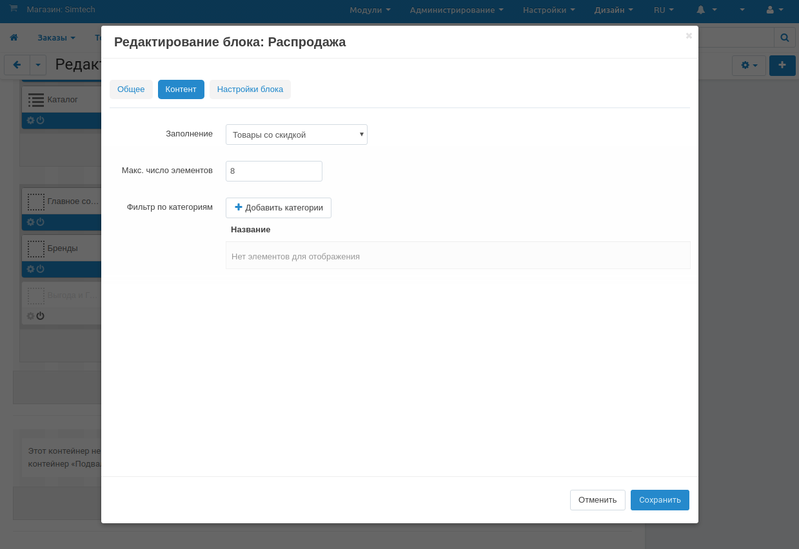

************************************
Как создать блок "Товары со скидкой"
************************************

Для добавления раздела **Распродажа** на домашнюю страницу, выполните следующие шаги:

1. В панели администратора откройте страницу **Дизайн → Макеты** и переключитесь на вкладку **Домашняя страница**.

2. Нажмите кнопку **+** на контейнере, в котором должен располагаться новый блок и выберите **Добавить блок**.

3. Переключитесь на вкладку **Создать новый блок** и выберите тип блока **Товары**. В открывшемся окне:

   * Введите название нового блока (например, *Распродажа*).

   * Выберите *Сетка** в поле **Шаблон**.

   * Нажмите **Создать**.

4. Нажмите на значок **шестерёнки** на блоке. В открывшемся окне:

   * Выберите оболочку в поле **Оболочка**.

   * Укажите CSS-класс в поле **Пользовательский CSS-класс**, если необходимо

5. Переключитесь на вкладку **Контент** и в поле **Заполнение** выберите **Товары со скидкой**.

6. Нажмите **Сохранить**.

.. note::

    После внесения изменений убедитесь в том, что блок отображается корректно. В некоторых случаях выбранные оболочки не подходят для определённых типов блоков.
