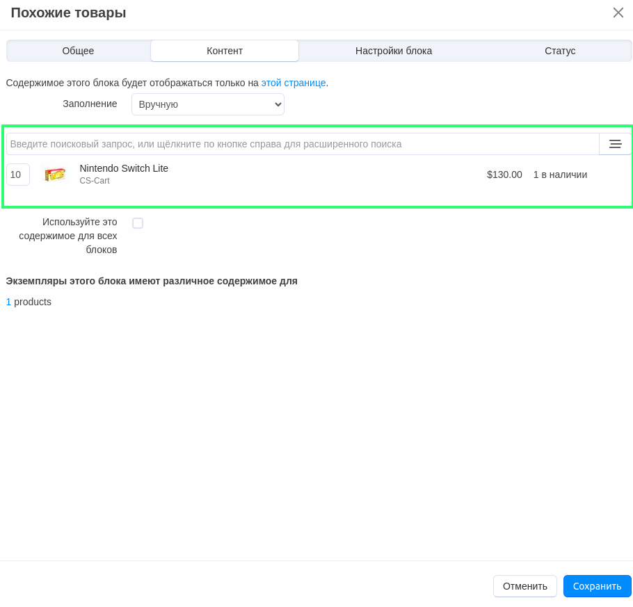

*****************************************************************
Как добавить раздел "Похожие товары" на детальную страницу товара
*****************************************************************

В разделе **Похожие товары** показаны товары, которые имеют между собой нечто общее или могут идти в комплекте с выбранным товаром. Например, геймпады и видеоигры имеют отношение к игровым приставкам, а телевизоры — к Blu-ray проигрывателям и аудиосистемам.

Для создания и добавления раздела **Похожие товары** на детальную страницу товара выполните следующие шаги:

===================
Шаг 1. Создаем блок
===================

1. В панели администратора откройте страницу **Веб-сайт → Темы → Редактировать макеты → вкладка "Товары"**.

2. Нажмите кнопку **+** на контейнере, в котором должен располагаться новый блок, и выберите **Добавить блок**.

3. Переключитесь на вкладку **Создать новый блок** и выберите тип блока **Товары**.

4. В открывшемся окне введите название блока (например, *Похожие товары*) и нажмите кнопку **Создать**.

5. На созданном блоке нажмите на значок **шестеренки**. В открывшемся окне укажите:

    * *Товары* в поле **Шаблон**.
    * Подходящую оболочку в поле **Оболочка**.
    * CSS-класс в поле **Пользовательский CSS-класс**, если необходимо.

    .. image:: img/related1.png
         :align: center
         :alt: Вкладка "Общее"

    * Переключитесь на вкладку **Контент** и в поле **Заполнение** выберите *Вручную*.
    * Нажмите **Сохранить**.

    .. image:: img/related2.png
        :align: center
        :alt: Вкладка "Контент"

========================================
Шаг 2. Добавляем блок на страницу товара
========================================

1. В панели администратора откройте **Товары → Товары** и выберите любой товар.

2. На странице редактирования товара откройте вкладку **Макеты**.

3. Найдите включенный блок **Похожие товары**.

4. Нажмите на значок **шестерёнки** на блоке и переключитесь на вкладку **Контент**. Введите название товара в поле поиска и выберите его.

5. Нажмите **Сохранить**.

.. note::

    После создания или изменения блока убедитесь в том, что он отображается корректно. В некоторых случаях оболочка может быть несовместима с блоком определенного типа.

.. image:: img/related4.png
    :align: center
    :alt: Блок "Похожие товары" на витрине

