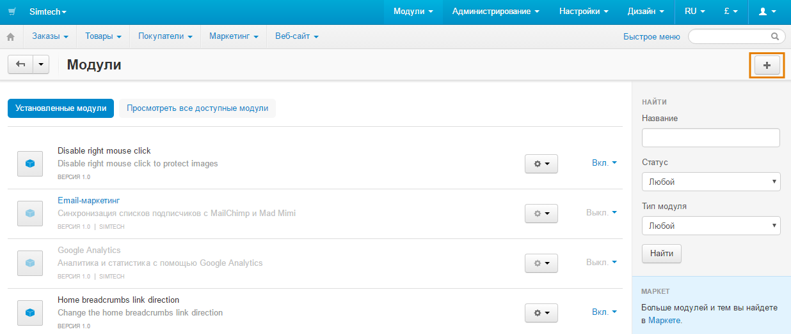
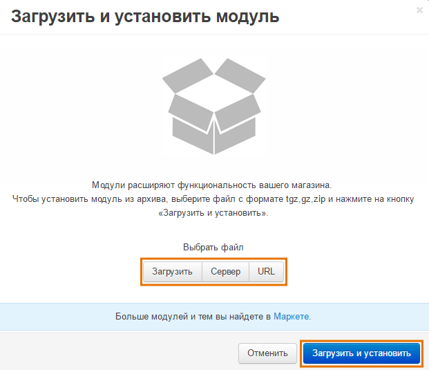
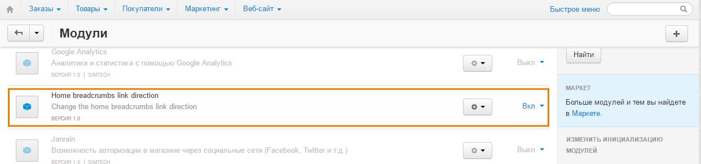

************************************************************
Как изменить, куда ведет ссылка "Главная" в строке навигации
************************************************************

В строке навигация есть ссылка "Главная". По умолчанию она ведет на главную страницу магазина, но это можно поменять с помощью бесплатного модуля **Home Breadcrumbs Link Direction**.

=======================
Шаг 1. Установка модуля
=======================

1. Скачайте архив с модулем на компьютер по `этой ссылке. <https://github.com/cscart/addon-breadcrumbs-home-link/archive/master.zip>`_

.. note::

    У модуля есть свой `репозиторий на GitHub. <https://github.com/cscart/addon-breadcrumbs-home-link>`_

2. Войдите в панель администратора вашего магазина.

3. Откройте страницу **Модули → Управление модулями**.

4. Нажмите кнопку **+**, чтобы установить модуль из архива.

5. Во всплывающем окне нажмите кнопку **Загрузить** и выберите архив с модулем.

6. Нажмите **Загрузить и установить**.

=================================
Шаг 2. Настройка ссылки "Главная"
=================================

1. После установки модуль **Home Breadcrumbs Link Direction** появится в списке. Нажмите на название модуля.

2. Откроется окно с настройками модуля. В поле **The home link of your store** укажите, куда должна ссылаться "Главная". По умолчанию стоит *http://www.domain.com*, замените его, например, на *http://example.com/mypage*.

3. Нажмите на кнопку **Сохранить**. Теперь ссылка "Главная" в строке навигации должна вести на *http://example.com/mypage*.
