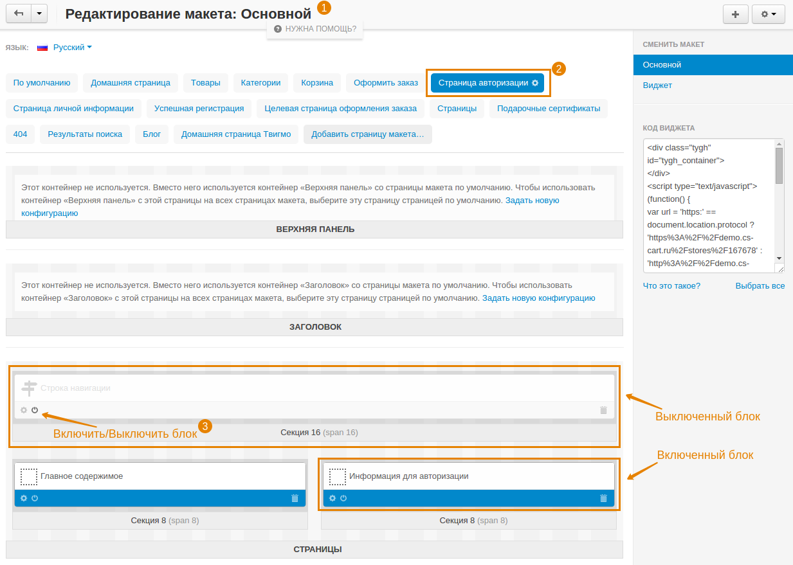
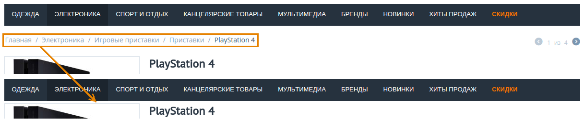

***************************
Как скрыть строку навигации
***************************

1. В панели администратора откройте **Дизайн → Макеты**.

2. Выберите макет страницы, для которой вы хотите выключить строку навигации.

.. note::

    Если страницы нет в списке макетов, выберите макет **По Умолчанию**.

3. Щёлкните по значку **Вкл./Выкл.** на блоке **Строка навигации**. Блок должен стать светлее.

4. Повторите указанные шаги для других страниц, на которых необходимо выключить строку навигации.

