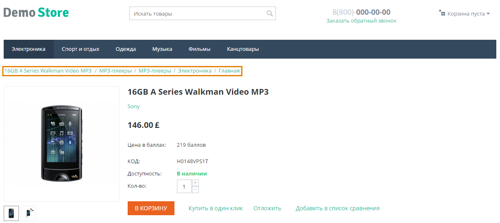
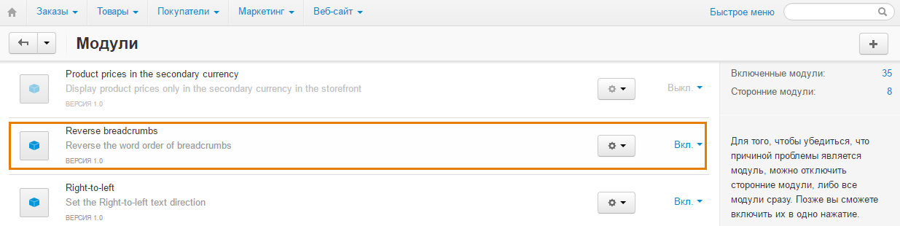

************************************************
Как изменить порядок разделов в строке навигации
************************************************

По умолчанию разделы в строке навигации перечислены от родительских к дочерним. Чтобы сделать наоборот, установите и включите бесплатный модуль **Reverse Breadcrumbs**.

================
Установка модуля
================

1. Скачайте архив с модулем на компьютер по `этой ссылке. <https://github.com/cscart/addon-breadcrumbs-reverse/archive/master.zip>`_.

.. note::

    У модуля есть свой `репозиторий на GitHub. <https://github.com/cscart/addon-breadcrumbs-reverset>`_.

2. Войдите в панель администратора вашего магазина.

3. Откройте страницу **Модули → Управление модулями**.

4. Нажмите кнопку **+**, чтобы установить модуль из архива.

.. image:: ../../changing_attributes/img/addons_plus_button.png
    :align: center
    :alt: Кнопка плюс на странице модулей

5. Во всплывающем окне нажмите кнопку **Загрузить** и выберите архив с модулем.

6. Нажмите **Загрузить и установить**.

.. image:: ../../changing_attributes/img/upload_and_install_addon.png
    :align: center
    :alt: Окно загрузки и установки

Порядок разделов в строке навигации автоматически поменяется сразу после установки и включения модуля.

.. note ::

    Если после установки модуля изменения не отображаются, `очистите кэш шаблонов. <../../../../developer_guide/addons/tutorials/addon_creation/cache>`

