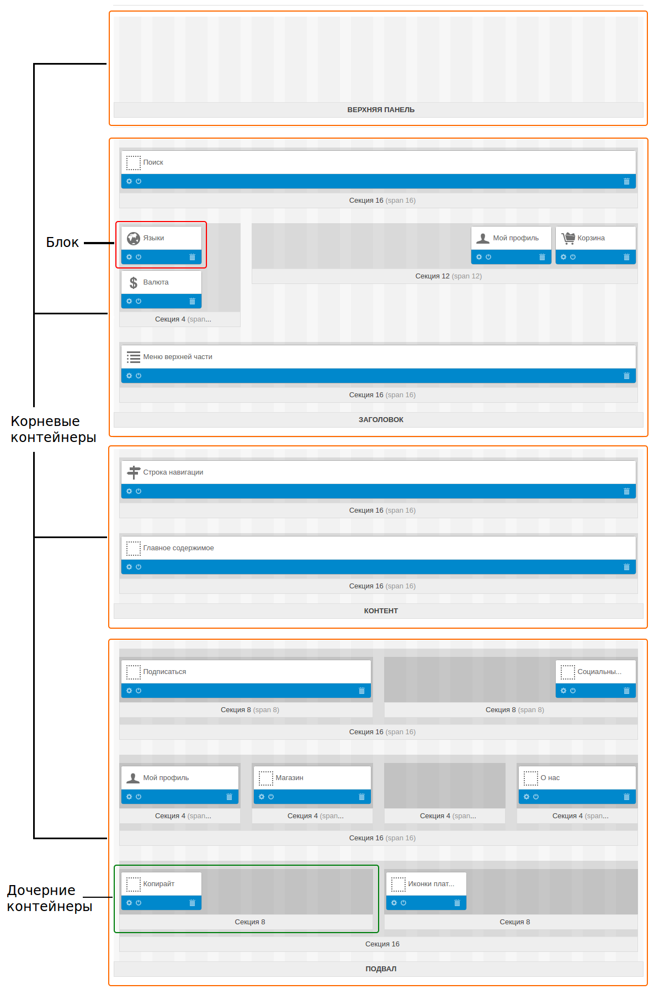
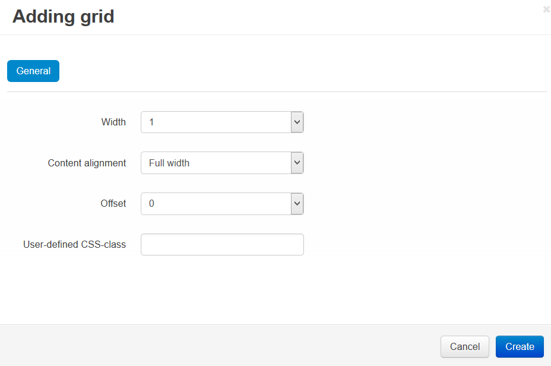

***************************
Каркас страницы (фреймворк)
***************************

==========
Контейнеры
==========

-------------------
Корневые контейнеры
-------------------

Любая страница витрины состоит из 4 горизонтальных **корневых контейнеров**:

* **Верхняя панель**

* **Заголовок**

* **Контент**

* **Подвал**

Корневые контейнеры нельзя добавлять и удалять. Они есть во всех макетах.

.. important::

    **Верхняя панель**, **Заголовок** и **Подвал** наследуются страницами макета от :doc:`страницы, выбранной по умолчанию. <../layout_pages/index>` Если поменять данные в этих трех контейнерах, то изменения затронут все страницы.

Каждый корневой контейнер отвечает за определенную область на странице — шапку сайта (header), основную часть страницы, подвал (footer). Но сами корневые контейнеры не добавляют никакой информации, а только группируют многочисленные **дочерние контейнеры**.

.. note::

    В корневом контейнере может не быть ни одного дочернего, но рекомендуем добавить хотя бы один.

-----------------------------------
Дочерние контейнеры: секции и блоки
-----------------------------------

Дочерние контейнеры (**секции**) позволяют точнее структурировать информацию на витрине и создавать более сложные макеты. Секции можно добавлять в корневые контейнеры или в другие секции, причем у каждой секции может быть свой размер, положение и стиль.

Внутри секций находятся **блоки** (один или несколько) — самостоятельные объекты, каждый из которых содержит определенную информацию.

Чтобы добавить секцию:

1. Нажмите кнопку **+** слева от названия контейнера, куда вы добавляете секцию. Выберите **Добавить секцию**.

2. Во всплывающем окне появится форма, где задаются свойства новой секции:

   * **Ширина** — ширина секции в колонках. Не может быть больше ширины контейнера, куда мы добавляем секцию. Подробности ниже (см. **Сетка Bootstrap**).

   * **Выравнивание содержимого** (только для дочерних контейнеров) — положение секции внутри корневого или родительского контейнера. Варианты: *Справа*, *Слева*, *Вся ширина*.

   * **Отступ слева** — количество пустых колонок слева от контейнера.

   * **Пользовательский CSS-класс** — если вы хотите задать контейнеру собственный CSS-класс, впишите имя класса здесь.

3. Нажмите **Создать**. 

===============
Сетка Bootstrap
===============

В CS-Cart используется фреймворк `Bootstrap <http://getbootstrap.com/>`_, который позволяет создавать макеты с определенной шириной или адаптивные. Сетка макета в CS-Cart состоит из 12 или 16 колонок.

Если страница занимает всю ширину окна, то ширина колонок адаптируется под ширину страницы. Если же задать конкретную ширину страницы, то ширина колонок будет фиксированной. Адаптивные макеты подходят для устройств с различными размерами экрана, в том числе для портативных.

Корневые контейнеры всегда занимают все 12 или 16 колонок сетки. Дочерние контейнеры не могут быть шире родительских.

.. toctree::
    :maxdepth: 4
    :hidden:

    container_properties
    grid_system
