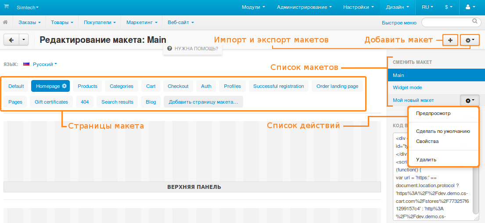

******
Макеты
******

Макеты определяют структуру витрины вашего магазина. Каждый макет состоит из так называемых :doc:`страниц макета <layout_pages/index>`. Страницы макета соотносятся с определенными страницами или типами страниц на витрине.

==============
В этом разделе
==============

.. toctree::
    :maxdepth: 1
    :titlesonly:
    :glob:

    blocks/index
	breadcrumbs/index
	framework/index
	layout_pages/index
	

.. toctree::
    :maxdepth: 1
    :hidden:

    layout_structure
	widget_mode/index

========================
Как редактировать макеты
========================

В панели администратора магазина перейдите на страницу **Дизайн → Макеты**.

.. hint::

    Рекомендуем два видеоурока по макетам: `№1 <https://www.cs-cart.ru/videos/admin/kak-upravlyat-maketami-stranic-v-magazine-na-cs-cart-chast-1.html>`_, `№2 <https://www.cs-cart.ru/videos/admin/kak-upravlyat-maketami-stranic-v-magazine-na-cs-cart-chast-2.html>`_.

Добавляйте новые макеты с помощью кнопки **+**. Список макетов находится справа, под заголовком **Сменить макет**. Переключайтесь между макетами, нажимая на их названия в списке. При наведении на название макета появится кнопка с изображением шестеренки. Нажмите на нее, и появится список действий:

* **Предпросмотр** — показать витрину с этим макетом в отдельной вкладке браузера.

* **Сделать по умолчанию** — использовать этот макет на витрине.

* **Свойства** — открыть всплывающее окно, где можно изменить свойства макета.

  .. important::

      Макет по умолчанию (т.е. используемый на витрине) удалить не получится. Сначала выберите другой макет по умолчанию.

---------------
Свойства макета
---------------

При создании и редактировании макета укажите его свойства:

* **Название** — название макета.

* **Скопировать данные из макета** (только при создании макета) — выберите макет, который хотите взять за основу для нового макета.

* **По умолчанию** — если поставить флажок, то макет станет макетом по умолчанию и будет использоваться на витрине.

* **Число колонок** — сетка макета может состоять из 12 или 16 колонок.

* **Ширина страницы** — определяет, как страницы макета будут себя вести при разных размерах окна браузера: 

  * *Фиксированная ширина* — например, 1200px; 

  * *Диапазон* — ширина страницы будет меняться при необходимости. Можно задать минимальную и максимальную ширину;

  * *По ширине окна* — страница будет адаптироваться к ширине окна.

================
Структура макета
================

Страницы макета (а значит, и страницы на витрине) состоят из :doc:`блоков <blocks/index>`. Блоки сгруппированы по контейнерам.

Каждый блок отображает каку-то информацию: логотип, информацию о товаре, строку навигации, поисковую форму и т.п. Перетаскивая, редактируя и удаляя блоки, вы меняете структуру страницы.

На картинках ниже представлена структура макета:

.. image:: img/layout_01.png
    :align: center
    :alt: Общий вид макета страницы

.. image:: img/layout_02.png
    :align: center
    :alt: Отдельные блоки

.. image:: img/layout_03.png
    :align: center
    :alt: Корневые и дочерние контейнеры
