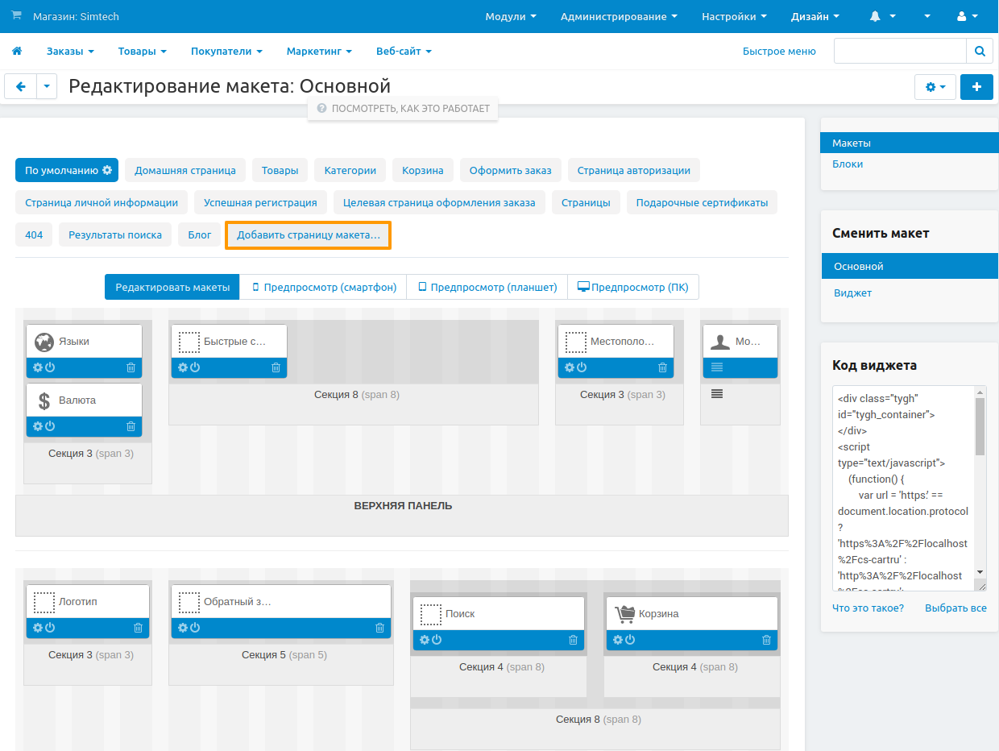
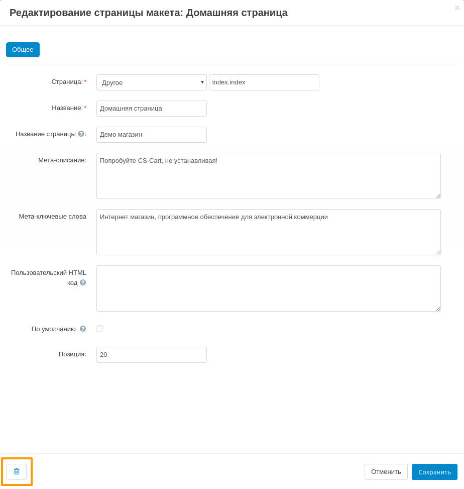

****************************
Управление страницами макета
****************************

Страницы макета не заданы жестко — их можно создать столько, сколько нужно. Но обычно хватает тех страниц, которые есть по умолчанию.

.. note::

    Чтобы работать со страницами макета, откройте панель администратора и перейдите на страницу **Дизайн → Макеты**. Все описанные действия совершаются на этой странице.

=====================================
Что можно делать со страницами макета
=====================================

------------------------
Добавить страницу макета
------------------------

1. На списке страниц макета выберите вкладку **Добавить страницу макета**.

2. В открывшемся окне задайте :doc:`настройки страницы макета. <layout_page_attributes>` 

3. Нажмите кнопку **Создать**.

-----------------------
Удалить страницу макета
-----------------------

1. Выберите страницу макета. Рядом с названием будет кнопка с изображением **шестеренки**. Нажмите на нее.

2. Появится окно редактирования страницы. Нажмите на кнопку с изображением **корзины**.

3. Подтвердите свой выбор, нажав **Ok**.

   .. warning::

       Страница макета будет удалена навсегда. Чтобы восстановить ее, понадобится заново ее создавать или импортировать.

----------------------------------
Изменить настройки страницы макета
----------------------------------

1. Выберите страницу макета. Рядом с названием будет кнопка с изображением **шестеренки**. Нажмите на нее.

2. Откроется всплывающее окно. Измените в нем :doc:`настройки страницы макета <layout_page_attributes>`.

3. Когда закончите с редактированием настроек, нажмите кнопку **Сохранить**.

================
Экспорт и импорт
================

Страницы макета можно экспортировать в XML-файлы и импортировать обратно. Это полезно, если нужно создать копию макета для другой витрины, а затем немного отредактировать.

Рекомендуем экспортировать страницы макета перед тем, как вносить в них изменения. Тогда вы сможете отменить эти изменения через импорт.

.. important::

    Импорт и экспорт страниц макета не учитывает состояние страницы макета у определённого объекта (например, товара, категории, страницы и т.д.). Если для какого-то объекта выключен какой-то блок, то эта информация не импортируется и не экспортируется.

----------------------
Экспорт страниц макета
----------------------

1. Нажмите на кнопку с изображением **шестеренки** в правом верхнем углу экрана. Выберите действие **Экспортировать макет**.

2. В появившемся окне укажите настройки экспорта:

   * **Страницы макета** — укажите, какие страницы макета нужно экспортировать.

   * **Вывод**—результат экспорта: 

     * *Скачать файл* — скачать экспортированный XML-файл на компьютер; 

     * *Сервер* — сохранить экспортированный XML-файл на сервере с установленным CS-Cart; 

     * *Экран* — показать экспортированные данные в окне браузера.

   * **Имя файла** — как будет называться экспортированный XML-файл. По умолчанию он называется *layouts_<время экспорта>.xml*.

3. Нажмите кнопку **Экспорт**.

---------------------
Импорт страниц макета
---------------------

1. Нажмите на кнопку с изображением **шестеренки** в правом верхнем углу экрана. Выберите действие **Экспортировать макет**.

2. В появившемся окне укажите настройки импорта:

   * Выберите импортируемый файл или введите его URL.

   * Выберите, создавать ли новый макет или обновить текущий выбранный макет. Если вы обновляете макет, появятся еще две настройки:

     * **Удалить все страницы макета перед импортом** — если поставить этот флажок, перед импортом будут удалены все страницы макета.

     * **Заменить страницы макета при совпадении** — если поставить этот флажок, то при импорте страницы макета из XML-файла будут заменять существующие страницы макета, если они соответствуют одним и тем же страницам на витрине. Остальные страницы макета просто будут добавлены как новые.

3. Нажмите кнопку **Импорт**.
