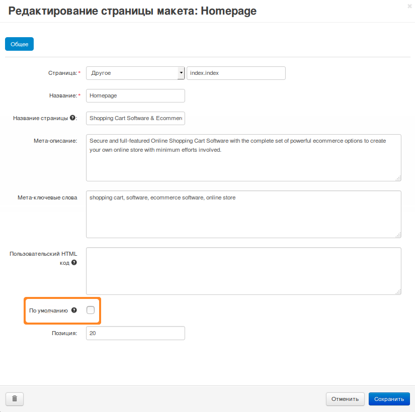

***************
Страницы макета
***************

:doc:`Макеты <../index>` состоят из т.н. страниц макета. **Страница макета** определяет структуру конкретной страницы (например, страницы оформления заказа) или группы страниц (например, детальные страницы товаров) на витрине.

.. note::

    Чтобы связать страницу макета с какой-то страницей или типом страниц на витрине, нажмите на изображение шестеренки рядом с названием страницы макета. В открывшемся окне поменяйте значение настройки **Страница** и сохраните изменения.

.. image:: img/configure_layout_page.png
    :align: center
    :alt: Рядом с названиями страниц макета есть кнопка с изображением шестеренки.

Если поменять что-то на странице макета, то изменения появятся на всех связанных с ней страницах на витрине. Например, если поменять страницу макета **Товары** (Products), то поменяются все страницы товаров на витрине.

.. important::

    Отдельные :doc:`блоки <../blocks/index>` можно включать/выключать для отдельных товаров, категорий и пр. Так можно сделать разные страницы одного типа, несмотря на то, что они используют одну и ту же страницу макета. 

============================
Страница макета по умолчанию
============================

Одна из страниц макета должна быть страницей по умолчанию. Именно с этой страницы берутся верхняя панель, заголовок и подвал. Страница макета по умолчанию также используется, когда для какого-то типа страниц нет собственной страницы макета.

Чтобы выбрать страницу макета по умолчанию, поставьте флажок **По умолчанию**, когда :doc:`задаете настройки страницы макета <actions_on_pages>`. Страницу по умолчанию нельзя удалить — сначала нужно выбрать другую страницу по умолчанию (она может быть только одна).

.. hint:

    Для разных макетов можно выбрать разные страницы по умолчанию.

=====================
Статьи в этом разделе
=====================

.. toctree::
    :maxdepth: 2
    :titlesonly:
    :glob:

    *
