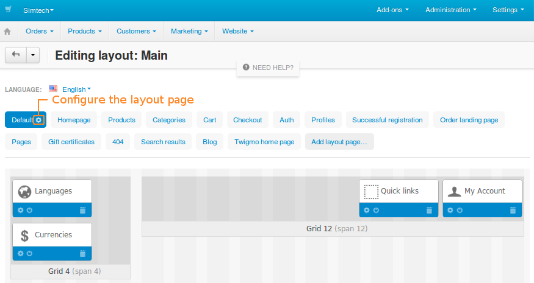
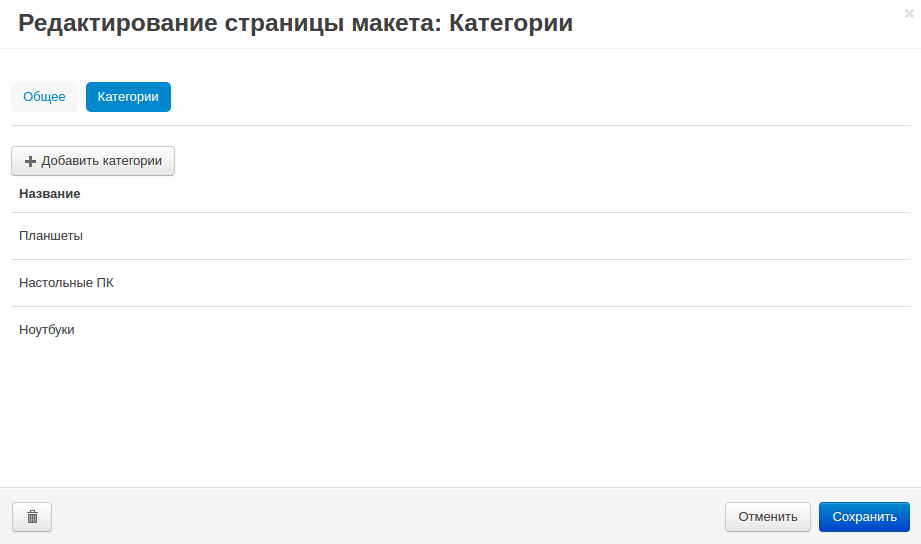

*************************
Настройки страницы макета
*************************

Чтобы задать настройки страницы макета, перейдите на страницу **Дизайн → Макеты**, выберите нужную страницу макета и нажмите на изображение **шестеренки** рядом с именем.

У любой страницы макета есть следующие настройки:

* **Страница** — определенная страница или тип страниц на витрине, которые используют эту страницу макета. Выберите тип страницы. Также можно выбрать *Другое* и задать страницу вручную.

  Страница задается в таком формате: ``[controller_name].[mode_name]``.

  * **[controller_name]** — имя PHP-контроллера.

  * **[mode_name]** – имя режима, в котором работает контроллер. 

  Это значение подставится после ``index.php?dispatch=`` и указывает на определенную страницу. Например, *index.php?dispatch=checkout.cart* ведет на страницу с содержимым корзины; *index.php?dispatch=checkout.checkout* ведет на страницу оформления заказа.
	
* **Название** — название страницы макета (отобразится в панели администратора).

* **Название страницы** — отобразится в заголовке вкладки браузера.

* **Мета-описание** — содержимое мета-тега <description> (описание страницы).

* **Мета-ключевые слова** — содержимое мета-тега <keywords> (ключевые слова страницы).

* **Пользовательский HTML код** — если вы знакомы с HTML, можете вставить сюда код, который нужно добавить в *<head></head>*.

* **По умолчанию** — если поставить флажок, эта страница макета станет страницей по умолчанию. Тогда содержимое контейнеров **Верхняя панель**, **Заголовок** и **Подвал** будет использоваться на других страницах макета.

* **Позиция** — положение страницы в списке страниц макета.

После редактирования настроек нажмите кнопку **Сохранить**.

.. note::

    У некоторых страниц макета могут быть дополнительные вкладки, например, **Категории** или **Товары**. Эти вкладки позволяют связать страницу макета с определенными товарами и категориями.

