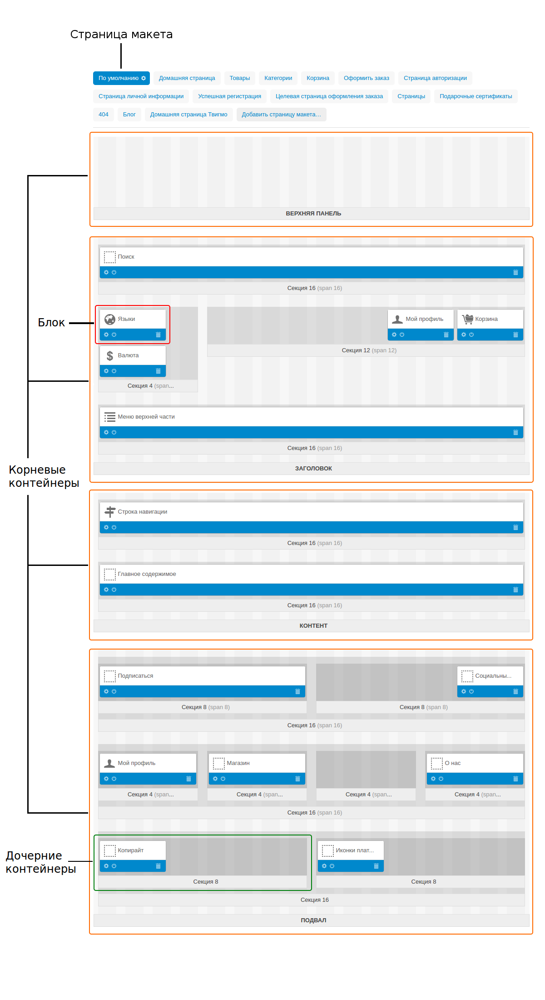
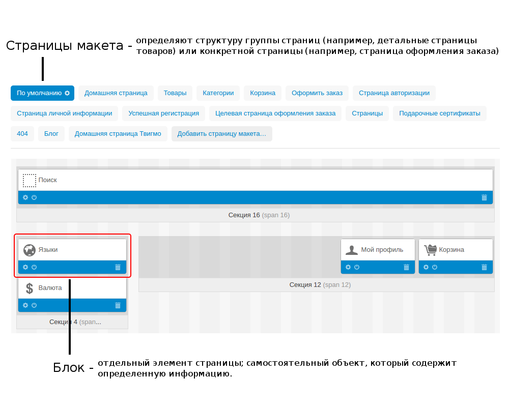
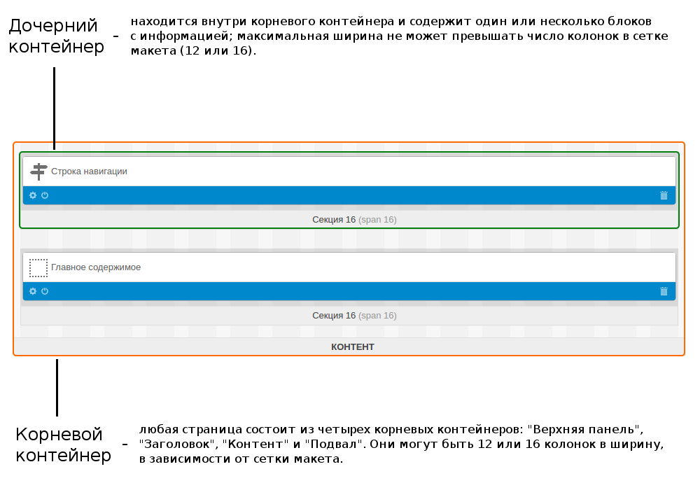

****************
Layout Structure
****************

.. warning::

    Эта страница уже неактуальна. Пожалуйста, :doc:`вернитесь на главную страницу раздела. <index>`

A layout is the combination of blocks and the method of their arrangement.

In the **Design → Layouts** section you can add a new layout with the **+** button or edit the existing one.

When editing or adding a layout, define the following attributes:

*	**Name** - The name of the layout.
*	**Copy data from layout** (when adding new layout) - Choose the layout from which you want to copy the content.
*	**Default** - If selected, the layout is set as a default.
*	**Grid columns** - Choose whether to use the 12- or 16-column grid in the layout.
*	**Layout width** - Choose how the pages layout will be formed: *Fixed width* - pages will have a fixed width (1200px, for example); *Full width* - pages will have the full-width layout; *Fluid* - pages will have the responsive layout.

To the right of the page there is the **Switch layout** section. Here you can switch a layout by clicking on it or use the gear button to perform the following actions:

*	**Preview** - Open the storefront in a separate page.
*	**Make default** - Make a layout default for the theme.
*	**Properties** - Open the **Edit layout** page.
*	**Delete** - Delete a layout. Pay attention that you cannot delete the default layout.

.. note::

	Click the **NEED HELP** button at the top of a page to see the video describing the features of the **Widget mode**.

The **Layouts** section enables you to manage and customize the layout of storefront pages. The storefront is built by the use of the framework where pages are assembled out of blocks nested inside containers.

Such a block conveys a certain piece of information like a logo, mini cart, product details, breadcrumbs, search form, navigation menu, etc. You can add, edit, remove, or simply move blocks around a page to organize the new look and feel. The following sketch presents the storefront structure and illustrates how a page may be composed.

