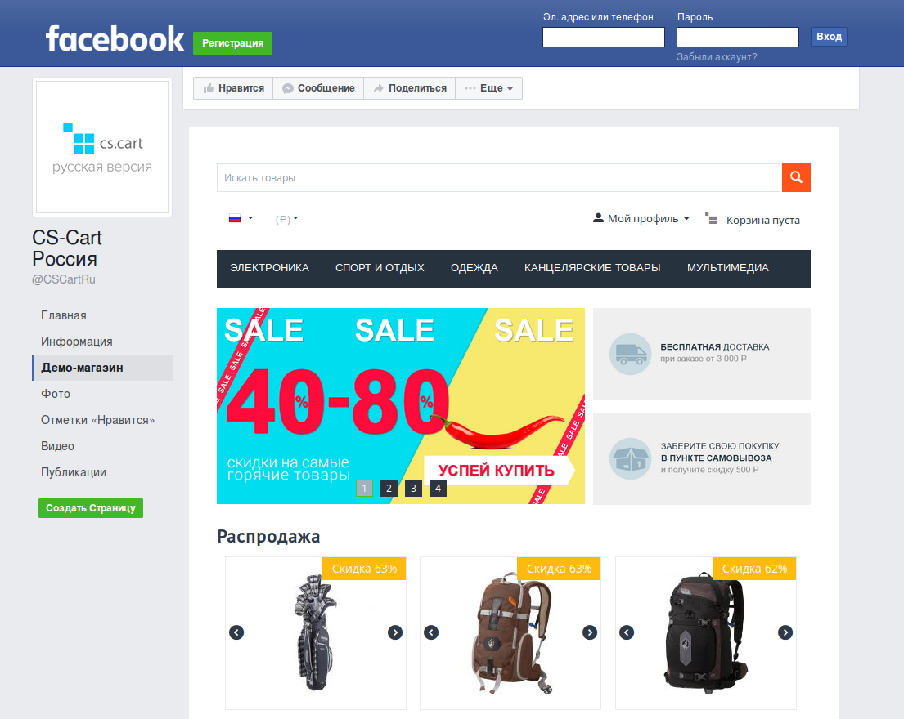
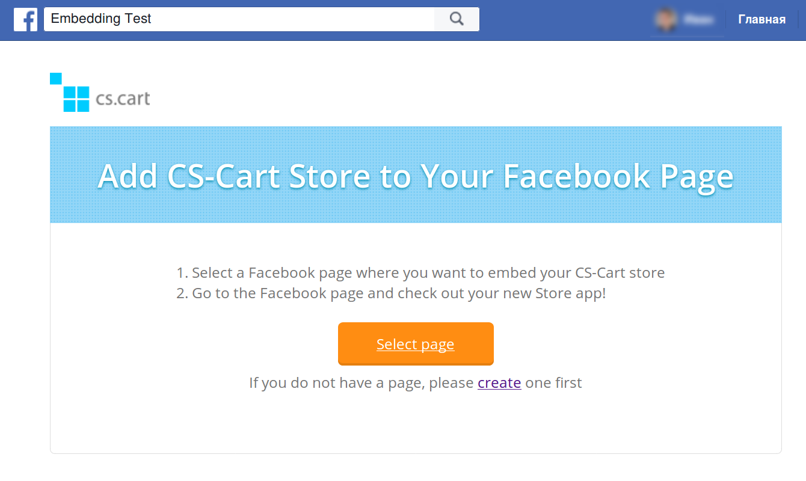
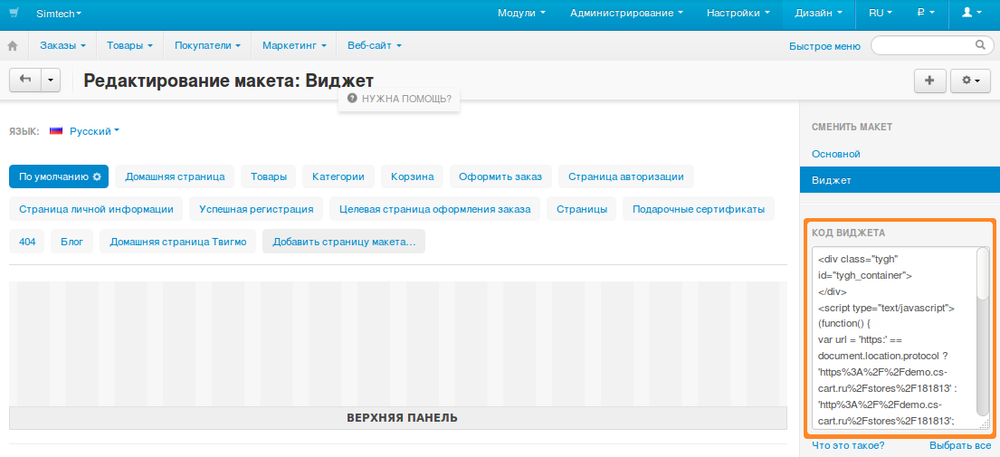
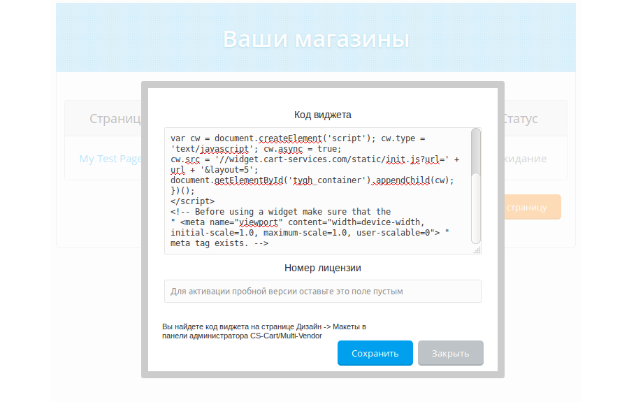

*************************************************
Как встроить магазин CS-Cart на страницу Facebook
*************************************************

`Приложение CS-Cart на Facebook <https://apps.facebook.com/cscart-store/>`_ позволяет за несколько минут встроить магазин на CS-Cart или Multi-Vendor на страницу Facebook.

.. important::

    Для корректной работы приложения необходимо, чтобы данные магазины передавались по протоколу HTTPS. Поэтому вашему магазину понадобится действующий SSL-сертификат.

Приложение работает так же, как и :doc:`режим виджета <index>`: достаточно скопировать несколько строк кода, добавить их на страницу приложения и указать страницу Facebook, на которую нужно добавить магазин.

После этого магазин сразу появится на указанной странице и сможет принимать заказы.

Магазин прямо в Facebook — это неплохой способ привлечь новых покупателей и просто стать ближе к аудитории.

.. note::

    Если сначала вы хотите увидеть, как это работает, приглашаем в `наш демо-магазин на Facebook. <https://www.facebook.com/CSCartRu/app/457462450989458/>`_

=============================================
Шаг 1. Выбираем страницу Facebook под магазин
=============================================

1.1. Откройте `страницу приложения CS-Cart для Facebook <https://apps.facebook.com/cscart-store/>`_ и нажмите кнопку **Выберите страницу**.

1.2. Выберите страницу, на которую хотите добавить магазин, и нажмите **Добавить Страницу в закладке**.

1.3. Страница перезагрузится и вы увидите таблицу, где у вашего магазина на Facebook будет статус *Ожидание*.

===========================
Шаг 2. Копируем код виджета
===========================

2.1. Откройте панель администратора магазина в другой вкладке браузера.

2.2. Откройте страницу **Дизайн → Макеты** и скопируйте код виджета у макета, который хотите использовать в магазине на странице Facebook.

.. note::

    Хотя на Facebook можно использовать и :doc:`макет по умолчанию <../index>`, лучше использовать отдельный макет: так можно будет отдельно менять внешний вид основного магазина и магазина на Facebook.

2.3. Вернитесь на страницу приложения на Facebook, нажмите **Установить магазин** и вставьте код в поле **Код виджета**.

2.4. Введите в поле **Номер лицензии** номер вашей лицензии CS-Cart или Multi-Vendor. Если не ввести номер, у приложения активируется 14-дневный пробный период.

2.5. Нажмите кнопку **Сохранить**.

Вот и все! Теперь магазин доступен прямо на странице Facebook и может принимать заказы.

==========================================
Шаг 3. Настраиваем внешний вид на Facebook
==========================================

Внешний вид магазина на Facebook можно менять из панели администратора:

* Страница **Дизайн → Темы** позволяет менять визуальное оформление магазина: цвета, шрифты и пр.

* Страница **Дизайн → Макеты** позволяет менять :doc:`блоки <../blocks/index>` на витрине. 

  .. note::

     Если для магазина на Facebook используется :doc:`макет по умолчанию <../index>`, то изменения в этом макете повлияют и на основной магазин.

У темы **Responsive** (стандартной темы CS-Cart) есть встроенный стиль Facebook. Он создан для того, чтобы магазин вписывался в дизайн социальной сети.
