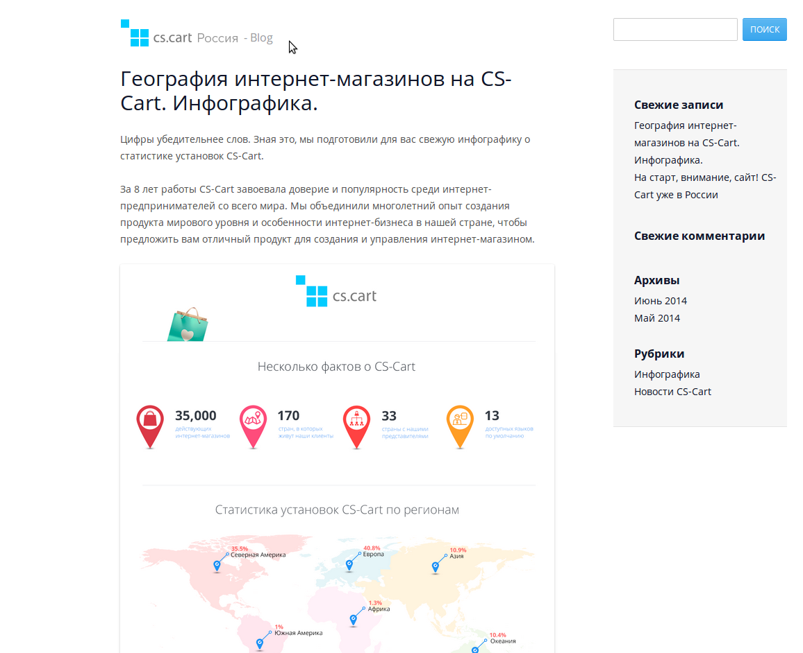

**********************************************
How To: Add a CS-Cart Site to a WordPress Page
**********************************************

The **Widget mode** allows you to embed the CS-Cart store to your WordPress site in just two steps.

===========================
Step 1. Get the Widget Code
===========================

1.1. Go to **Design → Layouts** in your CS-Cart Administration panel.

1.2. In the right side panel find the **Switch layout** section and choose **Widget mode**.

1.3. Copy the code from the **Widget code** section to clipboard.

   .. hint::

       You can also choose any other layout and use its code instead.

.. image:: img/widget_01.png
    :align: center
    :alt: Widget code

=============================================
Step 2. Add the Widget Code to WordPress Page
=============================================

2.1. Log in to your WordPress administration panel.

2.2. In the left panel choose **Pages → Add New**. You can also choose **Pages → All Pages** to edit one of the existing pages.

2.3. On the opened page speсify the title and simply paste the widget code from clipboard to the given text area.

2.4. Click the **Publish** button in the right section.

.. image:: img/widget_03.png
    :align: center
    :alt: New Page

2.5. Click **View Page** near the **Page published** notification to see this WordPress page with your CS-Cart store added.
