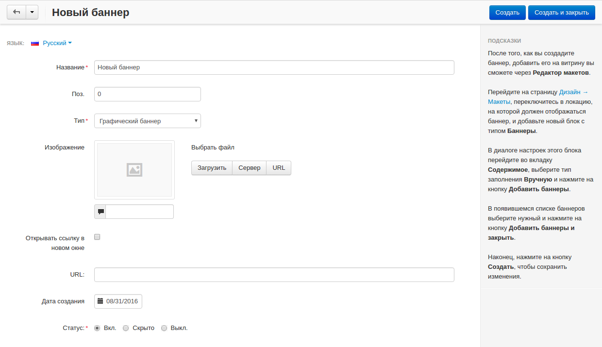
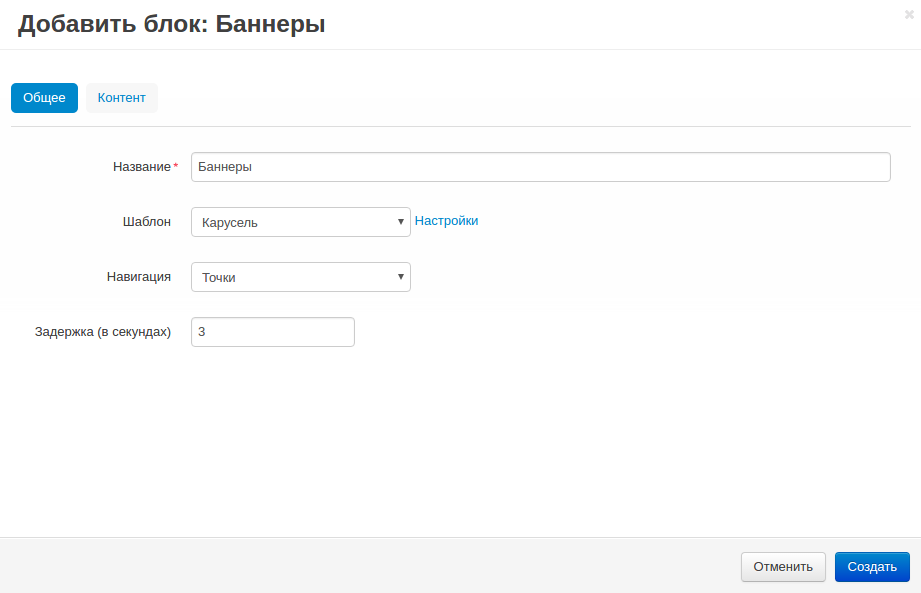
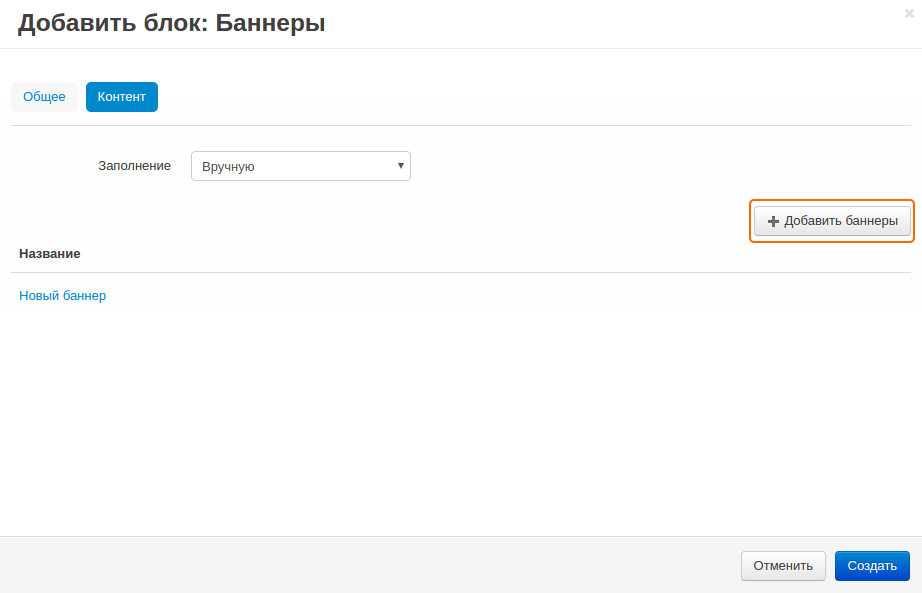

****************************************
Как добавить баннер на домашнюю страницу
****************************************

=====================
Шаг 1. Создаем баннер
=====================

1. В панели администратора откройте **Маркетинг → Баннеры**.

2. Нажмите кнопку **+** в правом верхнем углу и на открывшейся странице:

   * Введите **Название** баннера (например, *Новый баннер*).

   * В поле **Тип** выберите *Графический баннер*.

   * Загрузите изображение для баннера.

   * Поставьте галочку в поле **Открывать ссылку в новом окне**, если вы хотите, чтобы прикреплённая ссылка открывалась в новом окне/вкладке (Доступно только для графических баннеров).
   
   * В поле **URL** укажите ссылку на страницу, которая будет открываться при нажатии на баннер.

3. Нажмите кнопку **Сохранить и закрыть**.

============================================
Шаг 2. Добавляем баннер на домашнюю страницу
============================================

Прежде чем вывести баннер на домашнюю страницу, вам потребуется создать специальный блок для баннеров. 

1. В панели администратора откройте страницу **Дизайн → Макеты** и переключитесь на вкладку **Домашняя страница**.

2. Нажмите кнопку **+** на контейнере, в котором должен располагаться новый блок, и выберите **Добавить блок**.

3. Переключитесь на вкладку **Создать новый блок** и выберите тип блока **Баннеры**. В открывшемся окне:

   * Введите **Название** блока (например, *Баннеры*).
   * В поле **Шаблон** выберите *Карусель* и щёлкните по кнопке **Настройки** рядом с ним:

     * **Навигация** — выберите, как покупатели должны переключать баннеры на витрине.
     * **Задержка (в секундах)** — время между сменой баннеров.

4. Переключитесь на вкладку **Контент** и в поле **Заполнение** выберите *Вручную*.

5. Нажмите кнопку **Добавить баннеры** и выберите баннеры, которые должны показываться на витрине. Затем нажмите **Добавить баннеры и закрыть**.

6. Нажмите кнопку **Создать**.

