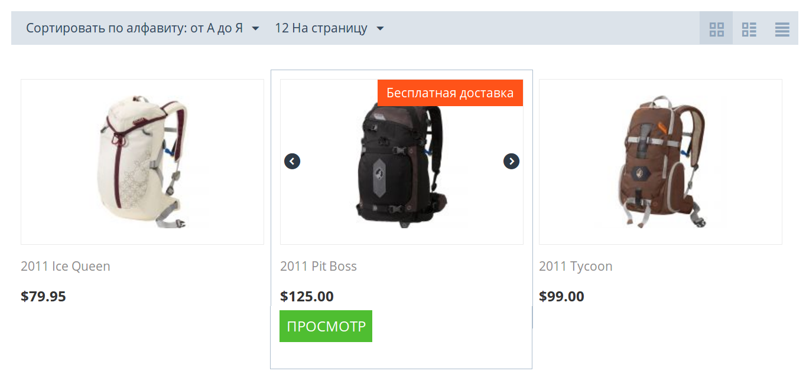

*******************************************************
Как рассказать о бесплатной доставке на странице товара
*******************************************************

На детальной странице товара со включенной настройкой **Бесплатная доставка** можно показать изображение или текст, сообщающие об этом. Для этого воспользуйтесь нашим бесплатным модулем.

.. note::

    Модуль разработан для темы **Responsive**, которая используется в CS-Cart и Multi-Vendor по умолчанию.

=========
Установка
=========

1. Скачайте одну из версий модуля. Какую версию качать, зависит от того, хотите ли вы отображать на странице товара картинку или текст.

   * `Модуль с картинкой. <https://github.com/cscart/addon-free-shipping-label/archive/image.zip>`_

   * `Модуль с текстом. <https://github.com/cscart/addon-free-shipping-label/archive/text.zip>`_

   .. note::

       Если хотите увидеть код, посетите `репозиторий модуля на GitHub. <https://github.com/cscart/addon-free-shipping-label/>`_ Две версии модуля хранятся в разных ветках.

2. Войдите в панель администратора вашего магазина.

3. Откройте страницу **Модули → Управление модулями**.

4. Нажмите кнопку **+**, чтобы установить модуль из архива.

.. image:: ../changing_attributes/img/addons_plus_button.png
   :align: center
   :alt: Кнопка установки собственного модуля из архива

5. Во всплывающем окне нажмите кнопку **Загрузить** и выберите архив с модулем.

6. Нажмите **Загрузить и установить**. Модуль установится и будет готов к работе.

.. note ::

    Если после установки модуля изменения не отображаются, :doc:`очистите кэш шаблонов. <../../../developer_guide/addons/tutorials/addon_creation/cache>`

.. image:: ../changing_attributes/img/upload_and_install_addon.png
   :align: center
   :alt: Модуль устанавливаетсяя и включается автоматически.

===========================
Как поменять картинку/текст
===========================

После установки модуля можно поменять картинку/текст на более подходящие.

---------------
Меняем картинку
---------------

.. note::

    Это решение подходит для `версии модуля с картинкой. <https://github.com/cscart/addon-free-shipping-label/tree/image>`_

Картинка "Бесплатная доставка" хранится в файле **free_shipping_label.png**. Файл лежит в папке *design/themes/responsive/media/images/addons/free_shipping_label_image/*. Можете заменить картинку на любую другую, но имя файла должно остаться **free_shipping_label.png**.

------------
Меняем текст
------------

.. note::

    Это решение подходит для `версии модуля с текстом. <https://github.com/cscart/addon-free-shipping-label/tree/text>`_

Текст "Бесплатная доставка" берется из языковой переменной ``free_shipping`` и поэтому может меняться при выборе другого языка.

Изменим значение языковой переменной:

1. В панели администратора перейдем на страницу **Администрирование → Языки → Переводы**.

2. Вобьем *free_shipping* в окно поиска справа и нажмем **Найти**.

3. Если у вас в магазине несколько языков, выберите тот язык, для которого вы хотите поменять текст. Это делается в левом верхнем углу страницы, под надписью **Переводы**.

4. Измените значение языковой переменной ``free_shipping``.

5. Нажмите **Сохранить**. 

.. important::

    Языковая переменная ``free_shipping`` существует в CS-Cart и Multi-Vendor даже без модуля. Если поменяете переменную, то изменится и название настройки **Бесплатная доставка** у товара.

Также вы можете создать свою языковую переменную кнопкой **+** button.

Назовем эту переменную ``example``. Чтобы использовать в модуле ее, а не ``free_shipping``, заменим ``__('free_shipping')`` на ``__('example')`` в файле *design/themes/responsive/templates/addons/free_shipping_label_text/hooks/index/scripts.post.tpl*.
