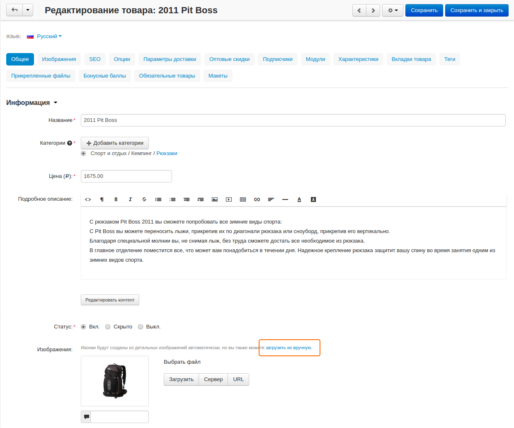
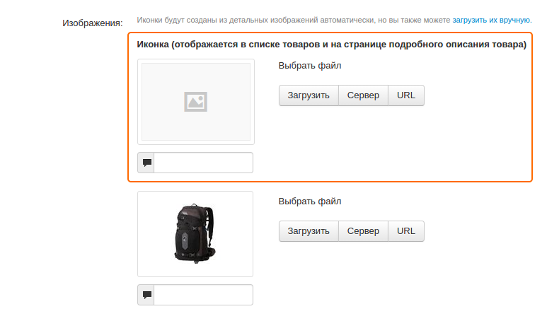

*******************
Управление иконками
*******************

По умолчанию иконки товаров создаются системой автоматически из изображений хорошего качества.

Для загрузки иконки вручную:

1. В панели администратора откройте **Товары → Товары**.

2. Выберите товар, для которого вы хотите добавить иконку и щёлкните по его названию.

3. На вкладке **Общее**, рядом с изображением товара щёлкните по ссылке **Загрузить их вручную**.

4. В открывшейся форме выберите загрузить **Иконку**.

.. note::

    Существует три способа загрузки изображения: непосредственно с компьютера, с сервера, на котором установлен CS-Cart посредством **Редактора файлов** или через ссылку на удалённый сервер, на который была загружено изображение. Альтернативный текст отображается на странице, когда изображение недоступно. Полезно иметь альтернативный текст, привязанный к изображению, в качестве дополнительного подспорья при работе с SEO.

5. Щёлкните **Сохранить**.

О том как настроить и изменить размер иконок можно узнать в :doc:`данной статье <../changing_attributes/change_image_size>`.

.. note ::

    После внесения изменений, вам потребуется очистить кэш иконок, чтобы система могла автоматически создать новые иконки. Для этого в панели администратора откройте **Администрирование → Хранилище данных** и нажмите **Удалить сгенерированные иконки**.

.. note ::

    Созданные иконки отображаются на детальной странице товара. После добавления дополнительных изображений, созданные иконки будут отображаться под главным изображением на детальной странице товара.

