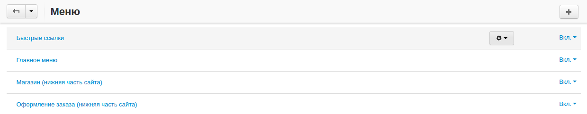
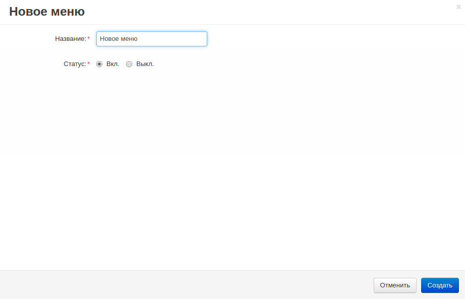
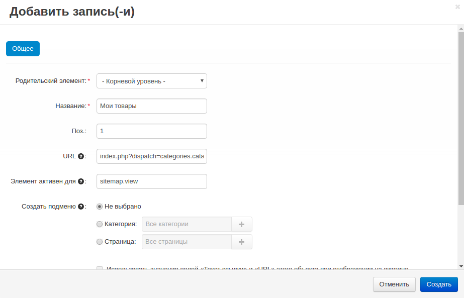
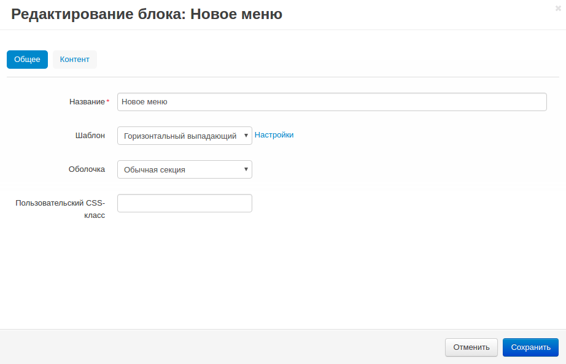

****
Меню
****

В данном разделе можно создавать пользовательские меню для витрины. Меню используются для упорядочивания контента (например, ссылки, страницы, категории, и т.д.) на страницах магазина. Используя блок *Меню* на странице с макетами, можно разместить меню в любой части витрины. Меню позволяют предоставить всю необходимую информацию, не занимая слишком много места.

В CS-Cart используется два типа меню: **созданные вручную** и **динамические**.

* **Созданные вручную** меню используют контент, добавленный пользователем вручную, например, внутренние и внешние ссылки в меню **Быстрых ссылок**.

* **Динамические** меню используют контент самого магазина, например, дерево категорий в меню **Главное меню**. 

Щёлкните по кнопке **+**, чтобы добавить новое меню, или щёлкните по кнопке **шестерёнки** рядом с выбранным меню и выберите **редактировать** для редактирования данного меню.

Чтобы создать новое меню и вывести его на витрину, выполните следующие шаги:

============================
Шаг 1. Создание пустого меню
============================

Все меню создаются пустыми.

1. В панели администратора откройте **Дизайн → Меню**.

2. Щёлкните **+**, чтобы добавить меню.

3. В открывшемся окне укажите **Название** меню (например, *Новое меню*).

4. Щёлкните по кнопке **Создать**.

======================
Шаг 2. Заполнение меню
======================

Вы можете заполнять меню вручную или используя контент магазина.

*   Click the gear button next to the created menu, choose **Manage items**, and in the opened window click the **+** button.
*   In the appeared window specify:

1. Щёлкните по **шестерёнке** рядом с созданным меню и выберите **Редактировать элементы**, в открывшемся окне щёлкните **+**.

2. В открывшемся окне укажите:

   * **Родительский элемент** — выберите подходящий родительский уровень.
   * **Название** — введите название элемента (например, *Новый элемент*).
   * **Поз.** — укажите позицию в списке элементов.
   * **URL** — введите URL страницы, которая будет открываться при переходе по ссылке (напрнимер, *index.php?dispatch=categories.catalog*).
   * **Элемент активен для** — элемент меню будет активен для указанной страницы (например, *sitemap.view*).

     .. note ::

         Если вы используете этот элемент для двух или более страниц, оставьте это поле пустым

   * **Создать подменю** — выберите, требуется ли подменю для данного элемента. Подменю может включать *категорию* (подкатегории выбранной категории) или *страницу* (дочерние страницы выбранной страницы).
   * **Пользовательский CSS-класс** — CSS-класс будет добавлен к пункту меню. Это позволит задать CSS-правила для конкретного пункта меню.

3. Щёлкните по кнопке **Создать**.

==============================
Шаг 3. Создание блока для меню
==============================

Чтобы вывести меню на витрину, вам потребуется создать :doc:`блок <../layouts/blocks/index>` типа *Меню*.

1. В панели администратора откройте **Дизайн → Макеты**.

2. Щёлкните **+** на контейнере, в котором будет располагаться блок и выберите вкладку **Добавить блок**.

3. Переключитесь на вкладку **Создать новый блок** и в списке выберите тип контейнера **Меню**.

4. В открывшемся окне введите название блока (например, *Новое меню*) и щёклните по кнопке **Создать**.

5. На созданном блоке щёлкните по значку **шестерёнки** и укажите:

   * Шаблон в поле **Шаблон**.
   * Оболочку в поле **Оболочка**.
   * CSS-класс в поле **Пользовательский CSS-класс** при необходимости.

6. Переключитесь на вкладку **Контент** и в поле **Меню** выберите нужное меню из списка, или создайте новое меню, щёлкнув по ссылке **Редактировать меню**.

7. Щёлкните **Сохранить**.

.. toctree::
    :maxdepth: 2
    :hidden:
    :glob:

    *
