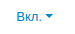
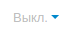

**************************
Работа с вкладками товаров
**************************

Для работы с вкладками на панели администратора перейдите на страницу **Дизайн → Вкладки товара**. 

==========================
Изменение названия вкладки
==========================

Для изменения названия вкладки товара щёлкните по кнопке **шестерёнки** рядом с нужной вкладкой и выберите **Редактировать**. После этого во всплывающем окне со свойствами страницы введите новое название вкладки и нажмите **Сохранить**.

==============================
Включение и выключение вкладок
==============================

Измените статус вкладки, чтобы включить или выключить её:

* Вкладка включена.

* Вкладка выключена.

===========================
Изменение положения вкладки
===========================

Для изменения положения вкладки относительно других вкладок просто перетащите её.

=================================================
Выключение вкладки на страницах отдельных товаров
=================================================

1. Щёлкните по кнопке **шестерёнки** рядом с нужной вкладкой и выберите **Редактировать**.

2. Во всплывающем окне переключитесь на вкладку **Статус** и в графе **Выключить для** щёлкните по кнопке **Добавить товары**. После чего откроется форма для добавления товаров.

3. Добавьте товары, на страницах которых данная вкладка отображаться не будет. Страницы других товары останутся без изменений.

4. Щёлкните **Добавить товары и закрыть**.

5. Нажмите **Сохранить**.

