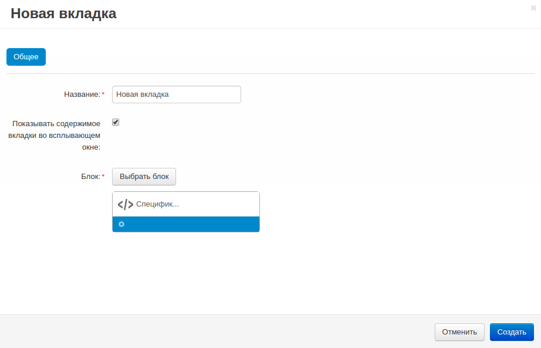
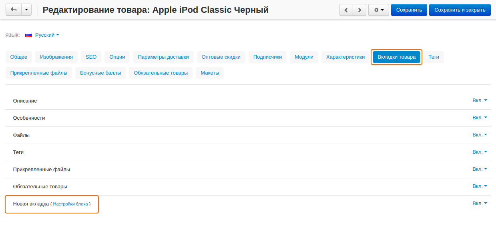
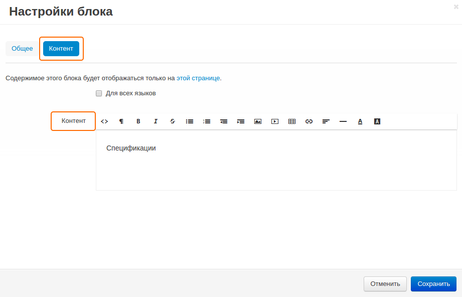

*******************************************************
Как добавить новую вкладку на детальную страницу товара
*******************************************************

========================
Добавление новой вкладки
========================

Для добавления новой вкладки с уникальным содержанием на детальную страницу товара:

1. В панели администратора откройте **Дизайн → Вкладки товара**

2. Щёлкните по кнопке **+**, чтобы добавить вкладку. В открывшемся окне:

   * Введите название вкладки (например, *Новая вкладка*).
   * Отметьте галочкой поле **Показывать содержимое вкладки во всплывающем окне**, если хотите, чтобы вкладка отображалась во всплывающем окне.
   * Щёлкните по кнопке **Выбрать блок**, переключитесь на вкладку **Создать новый блок** и выберите из списка **HTML блок**. В открывшемся окне:

     * Введите название блока (например, *Характеристики*).
     * Добавьте содержимое блока в поле **Контент** на вкладке **Контент**.
     * Нажмите **Создать**, чтобы создать блок.

   * Щёлкните **Создать**, чтобы создать вкладку. 

===========================
Изменение содержимого блока
===========================

Вы можете задавать разное содержимое блока для разных товаров. Для этого:

1. В панели администратора откройте **Товары → Товары** и выберите нужный продукт.

2. Переключитесь на вкладку **Вкладки товара** и щёлкните по ссылке **Настройки блока** рядом с названием созданной вкладки.

3. На открывшейся странице переключитесь на вкладку **Контент** и измените содержимое поля **Контент**.

4. Щёлкните **Сохранить**.
