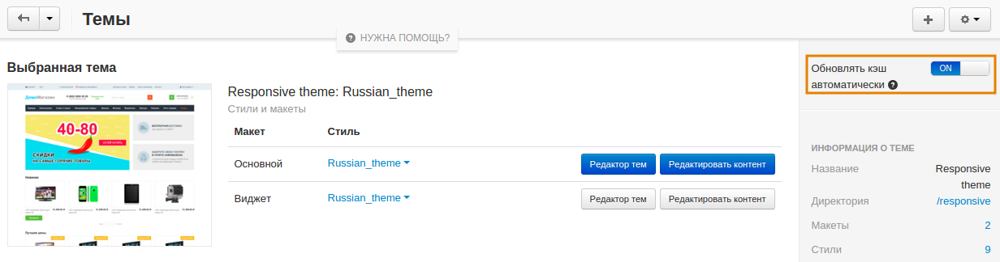

************************************
Изменения в шаблонах не отображаются
************************************

Если после внесения изменений в шаблон они не отображаются, очистите кэш вашего магазина. В панели администратора откройте **Администрирование → Хранилище данных** и щёлкните по кнопке **Очистить кэш**.

Также вы можете включить опцию **Обновлять кэш автоматически**. В результате, все изменения в файлах, как в магазине, так и на сервере, отслеживаются в реальном времени, и кэш обновляется автоматически. Для включения данной опции:

1. В панели администратора откройте **Дизайн → Темы**.

2. Найдите опцию **Обновлять кэш автоматически** и включите её.

.. note::

    Кэш блоков будет отключен. Возможно незначительное снижение скорости работы магазина. После внесения всех изменений в тему рекомендуется отключить в "Редакторе шаблонов".
