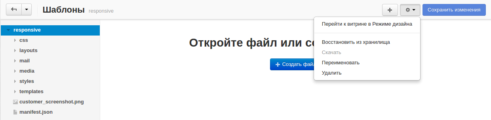

*******
Шаблоны
*******

Для редактирования в браузере исходного кода темы откройте страницу **Дизайн → Шаблоны**.

.. note ::

    Для работы с редактором файлов включите Javascript в своём браузере.

.. toctree::
    :maxdepth: 3
    :titlesonly:
    :glob:

    *

===================
Работа с редактором
===================

Редактор снабжён проводником для поиска элементов в папках темы, а также кнопками управления для работы с файлами и папками.

Основные функции управления редактором сгруппированы под кнопкой **+** и кнопкой со значком **шестеренки**.

* **Перейти к витрине в Режиме дизайна** — в режиме дизайна редактирование витрины происходит в реальном времени. Для редактирования шаблонов воспользуйтесь значком рядом с нужным элементом страницы. Наведите курсор мыши на значок, чтобы выделить нужный элемент, а затем выберите шаблон, который необходимо редактировать. После этого, появится всплывающее окно редактора файлов с исходным кодом шаблона. Отредактируйте код и нажмите **Сохранить**.

* **Восстановить из хранилища** — восстановление изначального варианта файла из папки темы.

* **Скачать** — сохранение выбранного файла на компьютер.

* **Переименовать** — переименование выбранного файла или папки.

* **Удалить** — удаление выбранного файла или папки.

* **Создать файл** — создание нового файла.

* **Создать папку** — создание новой папки.

* **Загрузить файл** — загрузка файла в открытую папку.

Узнать больше о редакторе файлов можно :doc:`в соответствующей статье. <../../../developer_guide/tools/file_editor>`
