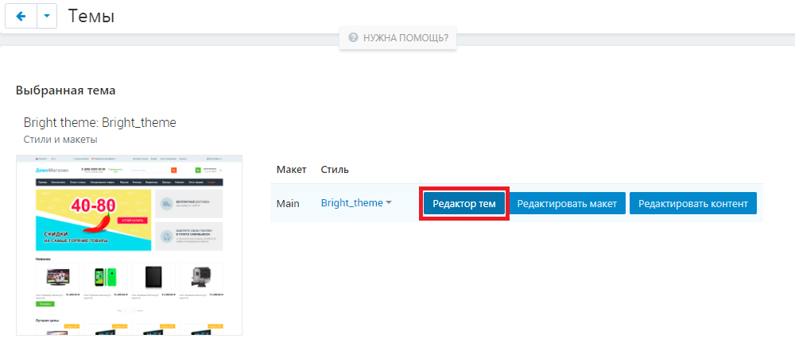
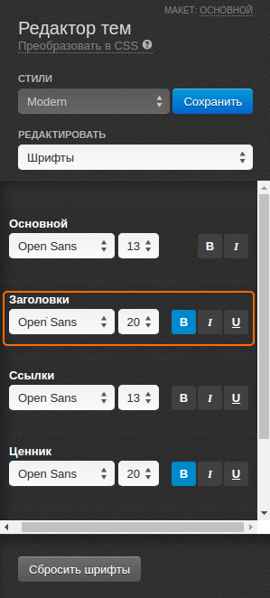
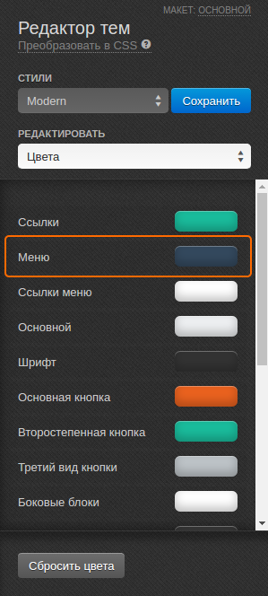
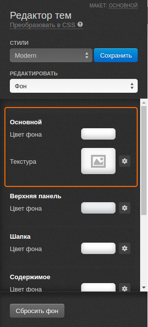

********************************************
Как изменить стиль элементов дизайна витрины
********************************************

=====================================================================================
Для изменения стиля (шрифт, цвет) отдельных элементов дизайна (ссылки, текст и т.д.):
=====================================================================================

1. В панели администратора перейдите в **Дизайн → Темы**.

2. В разделе **Выбранная тема** щёлкните по кнопке **Редактор тем**, расположенной рядом с нужным вам макетом.

===============================
Для изменения шрифта элементов:
===============================

1. В панели **Редактора тем** щёлкните по полю **Редактировать** и в выпадающем списке выберите **Шрифты**.

2. Выберите элемент, который требуется изменить и, используя соответствующие кнопки, задайте шрифт, размер и стиль.

3. Щёлкните по кнопке **Сохранить**.

.. important::

    Стили, доступные по умолчанию, изменять нельзя. Для сохранения изменений необходимо создать свой стиль. Для этого, после внесения изменений щёлкните по кнопке **Сохранить** рядом с выбранным стилем и во всплывающем окне введите название нового стиля.

==============================
Для изменения цвета элементов:
==============================

1. В панели **Редактора тем** щёлкните по полю **Редактировать** и в выпадающем списке выберите **Цвета**.

2. Чтобы изменить цвет определённого элемента, щёлкните по цвету рядом с его названием. Открыв окно выбора цветов, вы можете либо выбрать цвет из палитры, или же в соответствующем поле ввести шестизначный код (например, #000000 — чёрный, #FFFFFF — белый) нужного вам цвета. Введя код, щёлкните **Choose**.

3. Щёлкните по кнопке **Сохранить**

.. important::

    Стили, доступные по умолчанию, изменять нельзя. Для сохранения изменений необходимо создать свой стиль. Для этого, после внесения изменений щёлкните по кнопке **Сохранить** рядом с выбранным стилем и во всплывающем окне введите название нового стиля. 

===================================
Для изменения цвета фона элементов:
===================================

1. В панели **Редактора тем** щёлкните по полю **Редактировать** и в выпадающем списке выберите **Фон**.

2. Чтобы изменить цвет фона определённого элемента, щёлкните по цвету рядом с его названием. Открыв окно выбора цветов, вы можете либо выбрать цвет из палитры, или же в соответствующем поле ввести шестизначный код (например, #000000 — чёрный, #FFFFFF — белый) нужного вам цвета. Введя код, щёлкните **Choose**.

.. note::

    Также для **Основной** секции вы можете выбрать текстуру в качестве фона. Щёлкните по значку рядом с полем **Текстура** и выберите подходящую из списка текстур. Чтобы загрузить текстуру со своего компьютера, щёлкните по значку **шестерёнки**, а затем нажмите **Выбрать**. Изображение не должно весить больше 200 кб.

3. Щёлкните по кнопке **Сохранить**

.. important::

    Стили, доступные по умолчанию, изменять нельзя. Для сохранения изменений необходимо создать свой стиль. Для этого, после внесения изменений щёлкните по кнопке **Сохранить** рядом с выбранным стилем и во всплывающем окне введите название нового стиля. 

