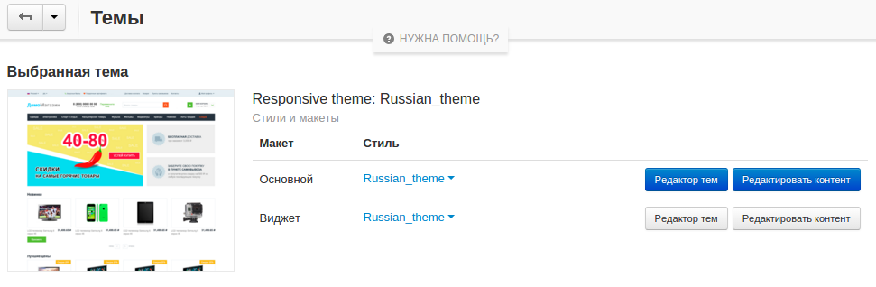
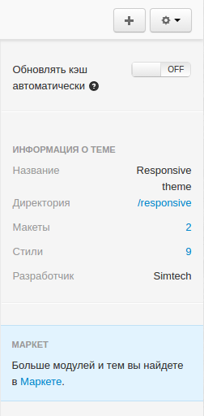
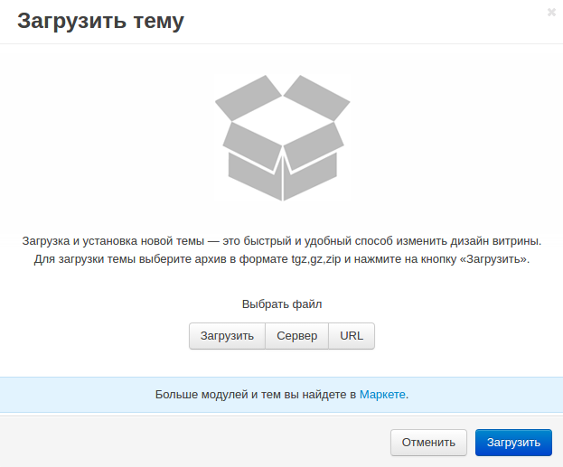

********************
Обзор раздела "Темы"
********************

================
Общая информация
================

В разделе **Дизайн → Темы** в панели администратора вы можете выбирать, устанавливать, загружать, удалять и редактировать темы для вашего магазина.

На данной странице расположена информация о теме, установленной в вашем магазине, список доступных тем, а также различные стили для них.

.. note::

    Щёлкните по кнопке **НУЖНА ПОМОЩЬ?** в верхней части страницы, чтобы просмотреть обучающие видео по редактированию внешнего вида вашего магазина.

=======================
Раздел "Выбранная тема"
=======================

В разделе **Выбранная тема** вы можете:

* Щёлкнув по кнопке **Редактор тем**, открыть **Редактор тем** для редактирования витрины в реальном времени. Также доступна возможность отдельного редактирования стилей **Основного** макета и макета **Виджета**.

* В поле **Стиль** из выпадающего списка выбрать отдельный стиль для каждого макета.

* Открыть **Редактор содержимого**, щёлкнув по кнопке **Редактировать контент**.

В **Редакторе содержимого** вам доступна витрина с элементами для редактирования, выделенными пунктирной линией. При этом вы можете переключаться между страницами также, как и в обычном режиме.

Для редактирования элемента наведите на него курсор и щёлкните по появившемуся значку, после чего измените значение элемента, заданное в поле. Щёлкните по "галочке", чтобы сохранить изменения. 

--------------------
Редактор содержимого
--------------------

С **Редактором содержимого** вы можете редактировать:

* Языковые переменные;

* Товары;

* Изображения;

* Категории;

* Страницы;

* Баннеры;

* Логотип витрины;

* Некоторые настройки.

===============================================================
Вкладки "Установленные темы" и "Просмотреть все доступные темы"
===============================================================

На вкладке **Установленные темы** доступен список тем с различными стилями, которые можно использовать в вашем магазине. Например, по умолчанию установлена тема **Responsive**, к которой в комплекте идёт набор тем — Black, Brightness, Facebook и т.д. 

Для установки стили наведите на курсор на изображение с предпросмотром и щёлкните по кнопке **Использовать этот стиль**.

.. image:: img/avail_themes.png
    :align: center
    :alt: Установленные темы

На вкладке **Просмотреть все доступные темы** доступен список всех тем, которые можно установить. Например, если вам нужно установить первоначальную тему по умолчанию, вы можете найти её здесь.

======================
Дополнительные функции
======================

В правой части страницы представлены дополнительная информация и функции. 

Здесь можно посмотреть название темы, название директории, в которой она установлена, число макетов и стилей, а также разработчика выбранной темы.

Здесь вы также можете:

* Открыть **Редактор файлов**, щёлкнув по названию директории установки.

* Перейти на странице с **макетами**, щёлкнув по числу макетов.

* Перейти к списку стилей выбранной темы, щёлкнув по числу стилей.

Загрузить новую тему можно с помощью копки **+** в правом верхнем углу страницы. В открывшемся выберите способ загрузки файла: с компьютера (**Загрузить**), с сервера, на котором установлен CS-Cart (**Сервер**) или с удалённого сервера, на котором расположен файл с темой, посредством URL (**URL**). Щёлкните **Загрузить**, когда будете готовы.

.. note::

    Архив темы должен быть в формате tgz*, *gz* или *zip*.

Щёлкните по кнопке **Шестерёнки** в правом верхнем углу и выберите **Скопировать тему**, чтобы скопировать выбранную тему для последующих изменений.

Также здесь расположена опция **Обновлять кэш автоматически**. Выберите **ON**, если хотите, чтобы файлы кэшировались в реальном времени.

----------------------------
Удаление скопированной темы:
----------------------------

* Убедитесь в том, что тема, которую вы хотите удалить, не используется в данный момент.

* Во вкладке **Установленные темы** найдите тему, которую необходимо удалить, и щёлкните по значку **Мусорной корзины** справ от её названия.

.. important::

    Прежде, чем удалять тему, убедитесь в том, что макет, используемый данной темой не установлен в качестве макета по умолчанию. В противном случае, вы не сможете удалить тему.

