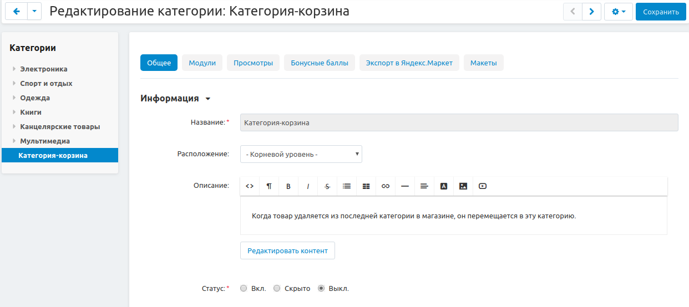

******************
Удаление категорий
******************

У каждой витрины есть одна **"Категория-корзина"**.

Она выводится последней в списке категорий витрины. Статус категории-корзины по умолчанию — *Выкл.*, чтобы исключить из показа товары в ней.

Категорию-корзину нельзя переименовать.

Товары и категории характеризуются принадлежностью к конкретной витрине.

При удалении категории все товары, не имеющие других назначенных категорий в той же витрине, что и сам товар, будут перемещены в категорию-корзину витрины. Если категория-корзина витрины при этом отсутствовала, она будет создана автоматически.

Значения характеристик, заданные вручную для этих товаров, сохраняются, изображения и прикрепленные файлы товаров не удаляются.

.. warning::

    При удалении категории-корзины сама категория и все товары, находящиеся в ней, удаляются окончательно — вместе с изображениями, прикрепленными файлами и характеристиками.
