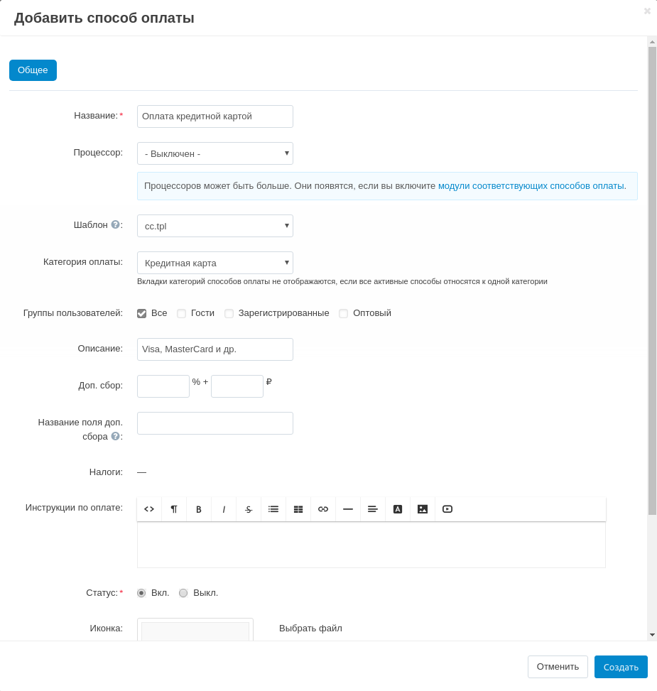

*************************************************
Способ оплаты с помощью кредитной карты (оффлайн)
*************************************************

Чтобы настроить способ оплаты с помощью кредитной карты без использования платежных систем:

1. Откройте страницу **Администрирование → Способы оплаты** в панели администратора.

2. Нажмите кнопку **+** (*Добавить способ оплаты*) справа. Откроется новое окно.

3. Введите **Название** способа оплаты.

4. Выберите *cc.tpl* в поле **Шаблон**.

5. Если необходимо, укажите остальные :doc:`настройки <configure_payment>`.

6. Нажмите кнопку **Создать**.

7. Проверьте этот способ оплаты:

   * Откройте витрину магазина и перейдите к оформлению заказа.

   * Выберите созданный способ оплаты. Откроется форма для данных кредитной карты.

   * После оформления заказа данные кредитной карты будут показаны на странице **Детали заказа** в панели администратора, и вы сможете снять деньги вручную.

    .. note::

        После размещения заказа он получит статус *"Открыт"*. Убедитесь, для этого статуса :doc:`выключена настройка "Удалить информацию о банковской карте" <../orders/order_statuses/remove_cc_info_auto>`.
