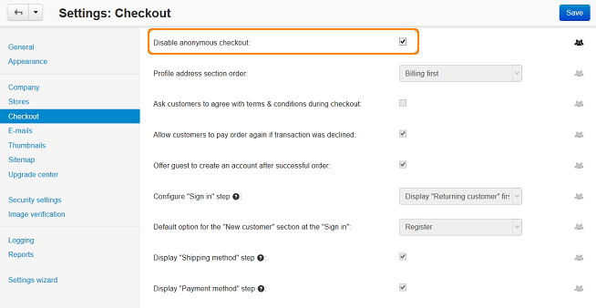

************************************************************************************
Как сделать регистрацию или вход в учетную запись обязательным при оформлении заказа
************************************************************************************

1. Перейдите на страницу **Настройки → Оформление заказа** в панели администратора.

2. Поставьте галочку **Покупатель должен зарегистрироваться либо войти, чтобы оформить заказ**.

3. Нажмите кнопку **Сохранить**.

.. important:: 

    Теперь на странице оформления заказа придется или войти в учетную запись, или зарегистрироваться. Возможности оформить заказ как гость не будет.

