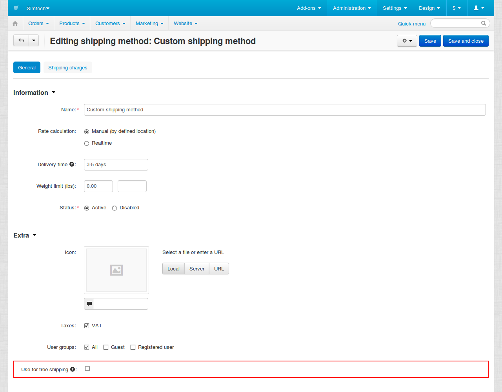

***************************
Способы бесплатной доставки
***************************

==================
Стандартный способ
==================

В разделе **"Администрирование → Доставка и налоги → Способы доставки"** при редактировании способа доставки можно включить настройку **"Использовать для бесплатной доставки"**.

Если эта настройка включена, то в стоимость доставки этим способом не будут входить товары, у которых на вкладке **"Параметры доставки"** включена настройка **"Бесплатная доставка"**. Для остальных товаров будут применяться правила из вкладки **Стоимость доставки** у способа доставки.

Если выключить настройку **"Использовать для бесплатной доставки"** у способа доставки, то настройка товаров **"Бесплатная доставка"** учитываться не будет.

.. note::

    Все товары, кроме цифровых, по умолчанию требуют доставки. Пользователь при оформлении заказа должен выбрать способ доставки, если заказ ее требует.

===================================
Не назначать способ доставки вообще
===================================

Чтоюы вообще не назначать заказам способ доставки, удалите все способы доставки или выставьте им статус *Выкл.* в разделе **"Администрирование → Доставка и налоги → Способы доставки"**.

=============================
Скрыть выбор способа доставки
=============================

Чтобы осуществлять доставку бесплатно, но назначать метод доставки и не требовать пользовательского выбора, необходимо:

1. В разделе **Настройки → Оформление заказа** отключить настройку **Показывать шаг "Способ оплаты"**.

2. В разделе **"Администрирование → Доставка и налоги → Способы доставки"** изменить существующий или создать новый способ доставки:

   * установить наименьшую позицию (**Поз.**), чтобы способ был первым в списке; 

     .. image:: img/position_setting.png
         :align: center
         :alt: New banner

   * выбрать для этого способа **Расчет тарифа вручную**;

     .. image:: img/manual_rate_calculation.png
         :align: center
         :alt: New banner

   * установить **Стоимость доставки**, равную *0*. 

     .. image:: img/shipping_charges.png
         :align: center
         :alt: New banner
