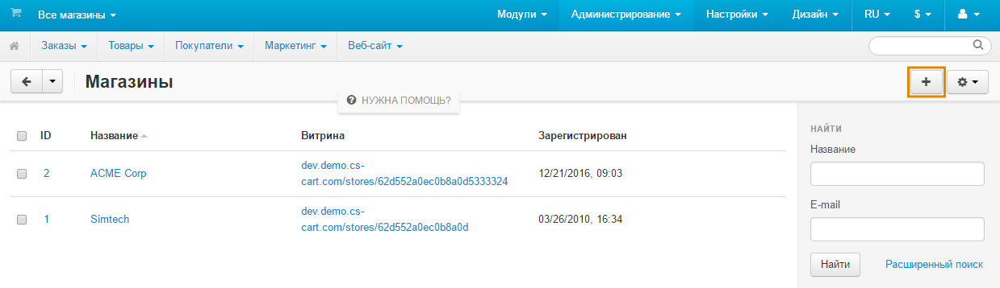
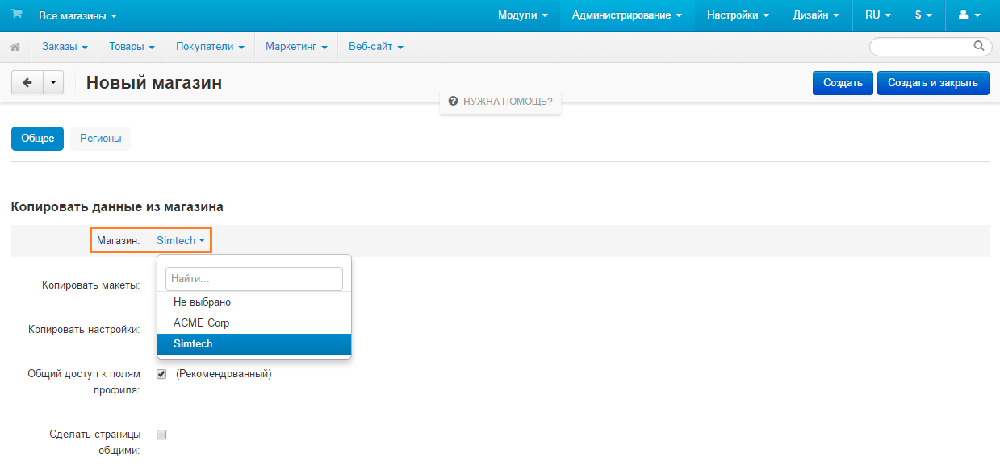
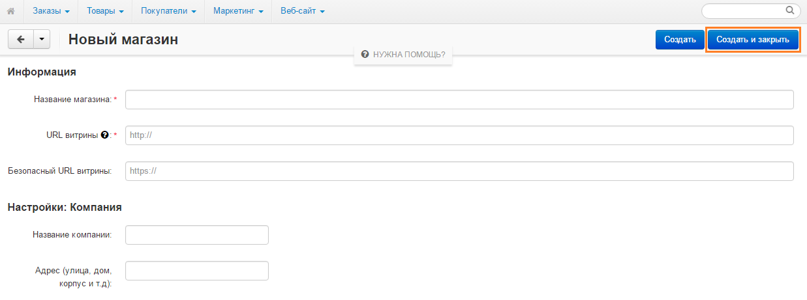

**************************
Как добавить новую витрину
**************************

1. Откройте панель администратора CS-Cart.

2. В панели выбора магазинов нажмите **Все магазины**.

.. image:: img/switch_modes.png
    :align: center
    :alt: Выберите "Все магазины", чтобы переключиться в режим главного администратора.

3. Откройте меню **Администрирование → Магазины** и нажмите кнопку **+**, чтобы открыть форму создания новой витрины.

4. Если у вас уже есть витрины, вы можете скопировать или поделиться содержимым одной из существующих витрин с новой.

5. Введите информацию и настройки новой витрины.

6. Нажмите **Создать и закрыть**, чтобы создать витрину и закрыть форму.

.. note::

    Для управления несколькими витринами с помощью одной панели администратора необходимо `приобрести соответствующее количество лицензий на дополнительные витрины <http://www.cs-cart.ru/dopolnitelnaya-vitrina.html>`_.