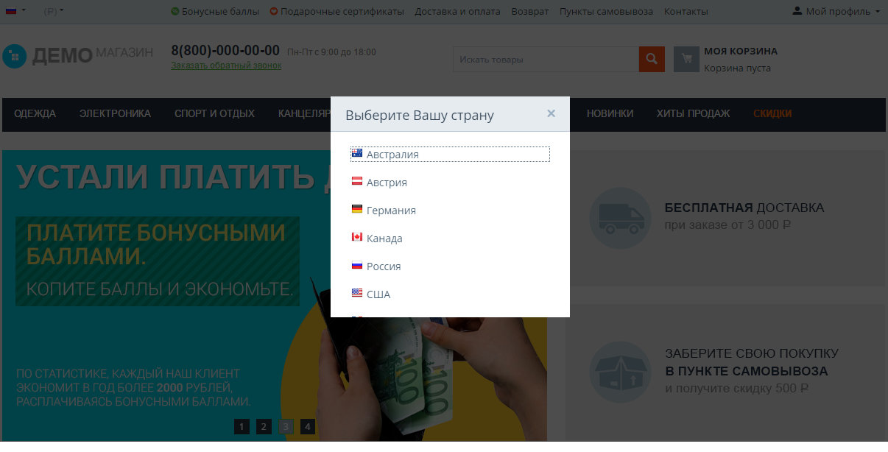
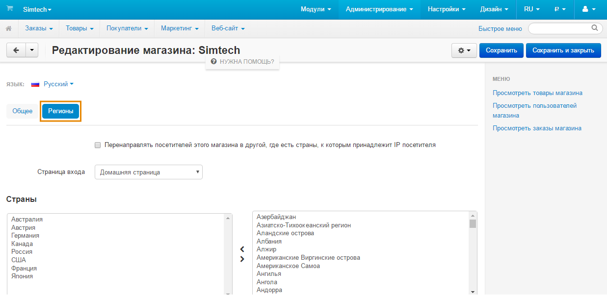

***************************************************
Как настроить общую точку входа для вашего магазина
***************************************************

==============================
Что такое “общая точка входа”?
==============================

**Общая точка входа** — это всплывающее окно, которое видят посетители магазина, впервые открывшие витрину. В окне отображается список стран и регионов. Каждый элемент списка ведёт на определённую витрину. При выборе страны или региона из списка посетитель магазина автоматически перенаправляется на соответствующую витрину.

Данная функция пригодится тем, кто хочет иметь несколько локализованных витрин с уникальными товарами для определённых стран и регионов.

Например, у вас есть основной магазин *www.example.com*, предназначенный для американского рынка. У него есть локализованная версия *www.example.ru* для России. А также четыре других витрины *www.example.au*, *www.example.ca*, *www.example.eu* и *www.example.co.uk* для Австралии, Канады, Евросоюза и Великобритании соответственно.

В такой ситуации общая точка входа поможет покупателям не потеряться на входе и найти нужный магазин.

.. important::
    Общая точка входа не определяет страну посетителя автоматически. Покупатель сам выбирает нужную ему страну или регион. 

==============================
Как создать общую точку входа?
==============================

Общая точка входа генерируется автоматически, в зависимости от настроек отдельно взятой витрины. Для добавления общей точки входа выполните следующие шаги:

1. Откройте меню **Администрирование → Магазины**.

2. Нажмите на название витрины, для которой вы хотите добавить общую точку входа.

3. Переключитесь на вкладку **Регионы**.

4. Укажите настройки общей точки входа:

   * **Включите общую точку входа:**

     Вы можете выбрать, где должна отображаться точка входа — на домашней странице или на всех страницах витрины. Второй вариант удобен в тех случаях, когда покупатель попадает к вам на сайт по прямой ссылке, минуя домашнюю страницу.

     .. important::
         Даже если не включать общую точку входа, вы сможете привязать витрину к определённой стране или региону из списка. Для этого выполните привязку стран и регионов к витрине, как описано ниже.

   * **Выполните привязку регионов и стран к определённой витрине:**

     Поле справа содержит список доступных стран и регионов; поле слева содержит список стран и регионов, привязанных к выбранной витрине. В случае, если в поле слева не указана ни одна страна или регион, общая точка входа не будет перенаправлять покупателей на данную витрину.

     Чтобы переместить элемент из одного списка в другой, воспользуйтесь двумя горизонтальными стрелками между полями. Для выбора нескольких элементов воспользуйтесь комбинацией **ЛКМ + клавиши Ctrl или Shift**.

     .. note::
         Чтобы настроить список стран, доступных в вашем магазине, воспользуйтесь меню **Администрирование → Доставка и налоги → Страны**.

5. Повторите *шаг 4* для всех оставшихся витрин.

.. note::
    В CS-Cart отсутствуют ограничения на список стран и регионов, которые можно привязать к витрине. При привязке страны или региона к двум и более витринам, посетители будут перенаправляться на первую витрину, к которой была привязана эта страна или регион.
