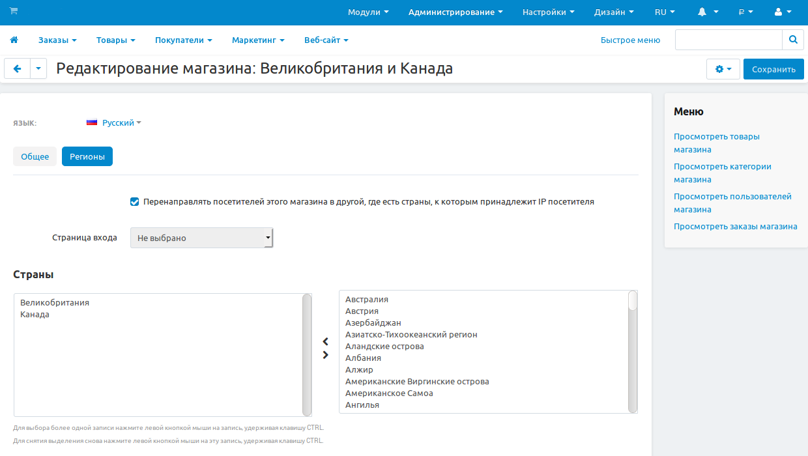

**********************************************************************************
Как перенаправлять покупателей из определённых регионов на соответствующие витрины
**********************************************************************************

Вы можете перенаправлять покупателей на отдельные витрины, созданные специально для определённых регионов. Предположим, что у вас есть две витрины:

* Первая — для Великобритании и Канады;
* Вторая — для Австралии и Новой Зеландии.

Сделаем так, чтобы покупатели из этих стран попали на нужную витрину:

1. В панели администратора CS-Cart откройте меню **Администрирование → Магазины**.

2. Выберите витрину, которую хотите отредактировать. Для начала отредактируем витрину для Великобритании и Канады.

3. Перейдите на вкладку **Регионы**.

4. Щёлкните по флажку **Перенаправлять посетителей этого магазина в другой, где есть страны, к которым принадлежит IP посетителя**.

   .. hint::
       Если оставить флажок пустым, покупатели не будут перенаправляться с витрины автоматически, даже, если для их страны создана другая витрина. 

5. Выберите страны из списка. В нашем случае это *Великобритания* и *Канада*.

6. Нажмите **Сохранить**.

Теперь при соблюдении 2 условий посетители будут перенаправляться с других витрин на эту:

* IP-адрес посетителя магазина относится к одной из выбранных стран.

* Витрина, на которую заходят покупатели, поддерживает переадресацию на другие витрины.

7. Таким же образом настройте другие витрины: повторите *шаги с 1 по 6*, но укажите другие страны. В нашем случае это *Австралия* и *Новая Зеландия*.

   .. note::
       В CS-Cart отсутствуют ограничения на список стран и регионов, которые можно привязать к витрине. При привязке страны или региона к двум и более витринам, посетители будут перенаправляться на первую витрину, к которой была привязана эта страна или регион.

Поздравляем! Теперь покупатели из указанных стран будут перенаправляться на соответствующие витрины.

   .. fancybox:: img/second_storefront.png
       :alt: Вы можете создать несколько витрин для различных стран или групп стран, после чего перенаправлять покупателей на подходящую витрину.
       
.. hint::
    Для определения страны по IP-адресу мы используем базы данных GeoLite2 от MaxMind, доступные на `https://www.maxmind.com <https://www.maxmind.com/>`_.