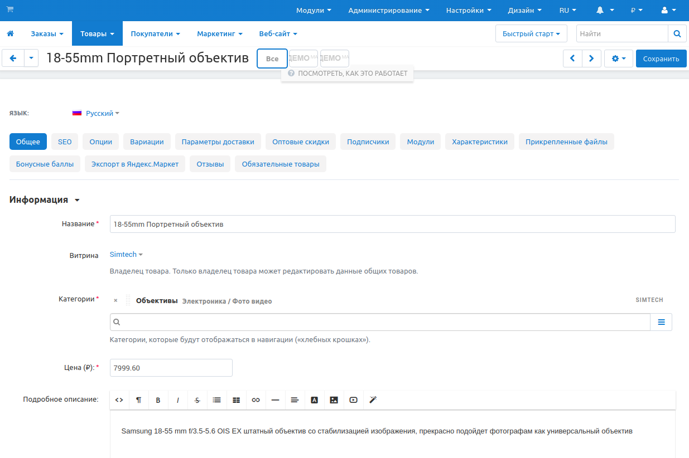
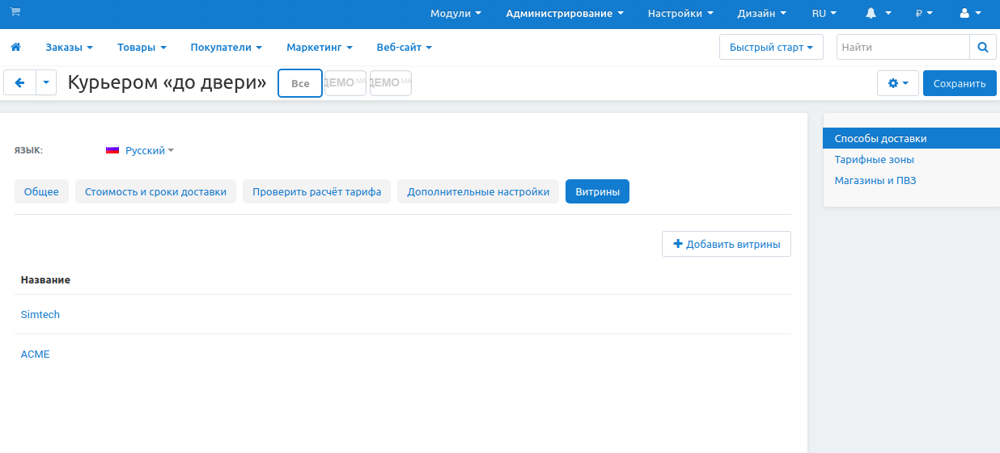

*********************************************
Как разместить объекты на нескольких витринах
*********************************************

=================
Как это работает?
=================

При создании объекта в CS-Cart (например, товара, страницы, промо-акции, способа доставки и т.д.) его необходимо привязать к какой-либо витрине. Однако после создания  объекты можно использовать на нескольких витринах одновременно.

.. note::
    Одну и ту же категорию нельзя использовать на нескольких витринах, так как именно категории определяют, к каким витринам относится тот или иной товар.

Для разных типов объектов в CS-Cart действуют разные правила размещения на нескольких витринах:

* **С возможностью изменения:** объекты размещаются на разных витринах и могут иметь разные свойства. Например, одному и тому же товару на разных витринах можно задать разные цены, описания и другие свойства.

* **Без возможности изменения:** объекты размещаются на витринах безо всяких изменений. Данный тип применяется к таким объектам, как характеристики и фильтры товаров, глобальные опции товаров, промо-акции, содержимое CMS, языки и способы доставки.

.. note::

    Также в CS-Cart можно :doc:`использовать одни и те же учетные записи пользователей на разных витринах. <customer_accounts>`

Помимо этого в CS-Cart существуют объекты, являющиеся общими для всех витрин, и у которых нет индивидуальных значений. Примерами данных объектов могут служить правила подсчёта налогов, статусы заказов, местоположения, страны и регионы, группы пользователей, поля профиля и т.д.

======================================
Размещение объектов на разных витринах
======================================

-------------------------------------------------------------------------------
Размещаем одни и те же товары на нескольких витринах (с возможностью изменения)
-------------------------------------------------------------------------------

1. Перейдите в **режим главного администратора**: в панели выбора магазинов нажмите **Все магазины**.

.. image:: img/switch_modes.png
    :align: center
    :alt: Выберите "Все магазины", чтобы переключиться в режим главного администратора.

2. Откройте страницу **Товары → Товары** и выберите товар, который необходимо разместить на нескольких витринах.

3. На вкладке **Общее** нажмите на кнопку **+** (*Добавить категории*). Откроется общее дерево категорий.

4. Выберите нужные категории, привязанные к другой витрине.

5. Нажмите **Добавить категории и закрыть**, чтобы закрыть всплывающее окно.

6. Нажмите **Сохранить**, чтобы применить изменения.

Товар будет добавлен в выбранные категории и появится на соответствующей витрине. После этого вы можете переключиться в режим администратора витрины и отредактировать характеристики товара для данной витрины.

---------------------------------------------------------------------------------
Размещаем одни и те же объекты на нескольких витринах (без возможности изменения)
---------------------------------------------------------------------------------

1. Перейдите в **режим главного администратора**: панели выбора магазинов нажмите **Все магазины**.

.. image:: img/switch_modes.png
    :align: center
    :alt: Выберите "Все магазины", чтобы переключиться в режим главного администратора.

2. Выберите объект, который необходимо разместить на нескольких витринах. Например, чтобы разместить способ доставки на нескольких витринах, откройте страницу **Администрирование → Доставка и налоги → Способы доставки**.

3. Нажмите на **кнопку с изображением шестерёнки**, расположенную рядом с нужным объектом, и выберите **Редактировать**. Откроется меню настроек объекта.

4. Перейдите на вкладку **Сделать общим**. На ней отображается список витрин, на которых размещён данный объект.

.. note::
    Вкладка **Сделать общим** не отображается при наличии только одной витрины, так как в этом случае нет необходимости делать что-то общим для нескольких витрин.

5. Нажмите на кнопку **+** (*Добавить магазины*), чтобы открыть список витрин.

6. Из списка выберите витрины, на которых будет размещён объект. Затем нажмите **Добавить магазины и закрыть**, чтобы обновить список витрин, на которых будет размещён объект.

7. Нажмите **Сохранить**, чтобы применить изменения.