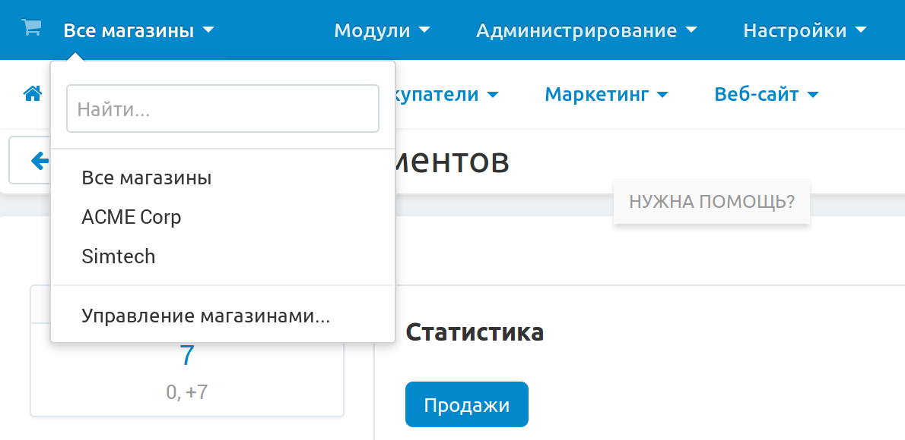

**********************************
Как переключаться между витринами
**********************************

:doc:`Настроив в своём магазине мультивитринность <../../install/storefronts/index>`, вы сможете переключаться между **режимом главного администратора**, управляющего объектами на всех витринах, и **режимом администратора витрины**, отвечающего за объекты, привязанные к одной определённой витрине. Под объектами имеются в виду товары, категории, страницы и т. д.

Для переключения между режимами нажмите на выпадающий список в левом верхнем углу панели администратора и выберите:

* **Все магазины**: режим главного администратора.
* **Название нужной витрины**: режим администратора этой витрины.

.. note::
    В случае, если в вашем магазине только одна витрина, будет доступен только один режим, в котором администратор витрины является одновременно и главным администратором.