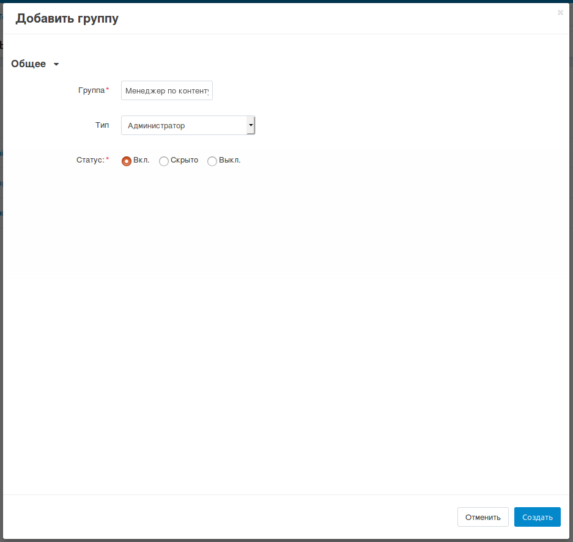

****************************************
Как создать новую группу администраторов
****************************************

Администраторы не всегда должны иметь полный доступ к управлению магазином. Чтобы ограничить права некоторых администраторов, назначим им группу с ограниченными правами.

----------

.. important::

    Только главный администратор можно назначать группы пользователей для других администраторов. Учётная запись главного администратора автоматически создаётся во время установки CS-Cart или Multi-Vendor. Ещё можно создать такую запись вручную, как описано ниже.

Если администратор не может назначать группы пользователей, то в первую очередь убедитесь, что учётная запись этого администратора сама не привязана к какой-либо группе пользователей. Затем убедитесь, что в базе данных, в таблице ``cscart_users``, в поле ``is_root`` для вашей учётной записи администратора стоит значение **Y**.

===================================
Шаг 1. Создаем группу пользователей
===================================

1.1. В панели администратора перейдите на страницу **Покупатели → Группы пользователей**.

1.2. Нажмите кнопку **+** в правой части страницы. Откроется всплывающее окно создания группы.

1.3. Укажите название группы, а в поле **Тип** выберите *Администратор*.

1.4. Нажмите кнопку **Создать**.

1.5. Откройте только что созданную группу и назначьте её нужные права.

1.6. Нажмите кнопку **Сохранить**.

.. image:: img/admin_privileges.png
    :align: center
    :alt: Задаем привилегии для группы администраторов в CS-Cart.

=========================================
Шаг 2. Добавляем администраторов в группу
=========================================

2.1. Перейдите на страницу **Покупатели → Администраторы**.

2.2. Нажмите на имя администратора. Откроется страница редактирования учетной записи.

2.3. Перейдите во вкладку **Группы пользователей**. 

2.4. Поменяйте статус у созданной группы на **Вкл.**

.. important::

    Теперь когда администратор войдет в учетную запись, то его привилегии будут такими же, как у группы.
