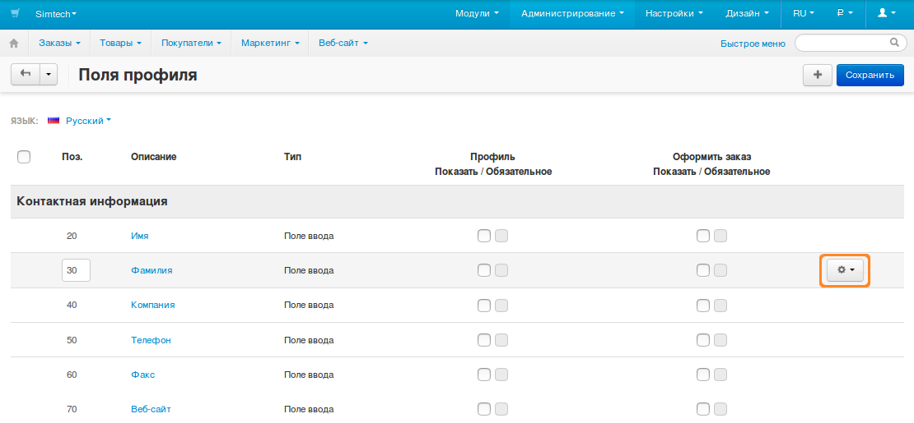
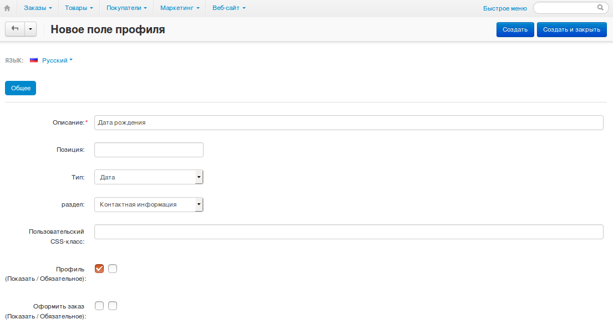
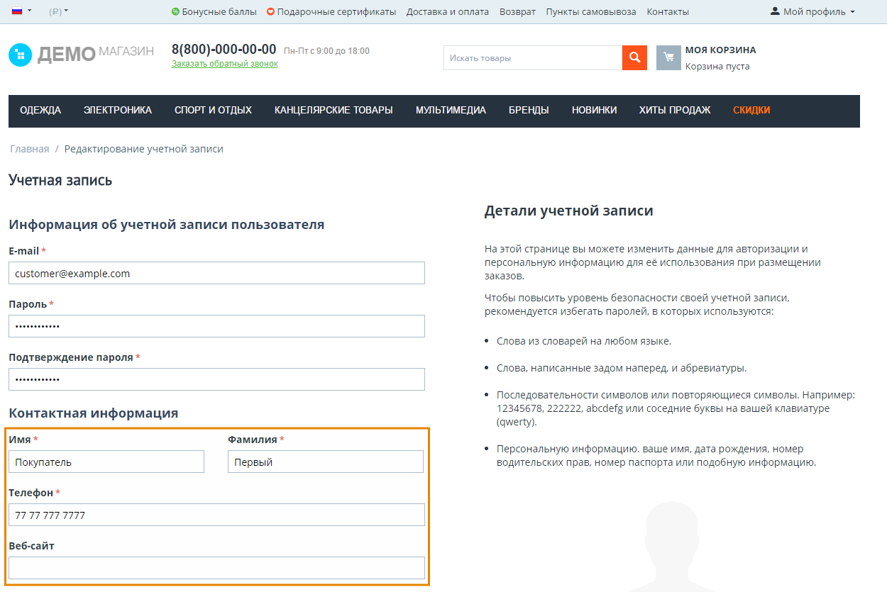
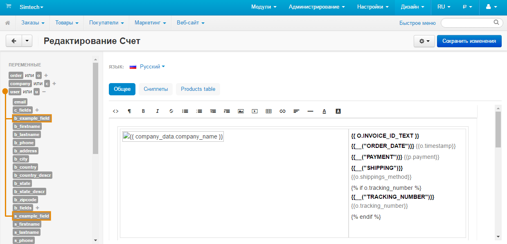
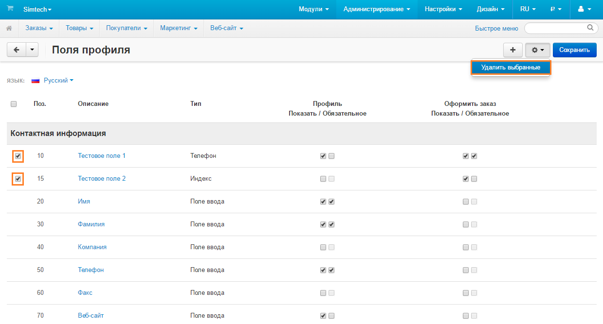

*************************
Управление полями профиля
*************************

Поля профиля содержат различную информацию о пользователе. Пользователи заполняют данные поля при регистрации учётных записей, редактировании профилей или во время оформления заказов. Некоторые поля могут быть обязательными для заполнения.

Список полей профиля доступен в меню **Администрирование → Поля профиля**. На этой странице вы можете:

.. contents::
   :backlinks: none
   :local:

===================================
Добавить/Редактировать поля профиля
===================================

1. Чтобы добавить поле профиля, нажмите на кнопку **+** в правом верхнем углу. Для редактирования существующего поля нажмите на **кнопку с изображением шестерёнки** рядом с нужным полем и выберите **Редактировать**.

.. image:: img/add_or_edit_field.png
    :align: center
    :alt: Кнопки, с помощью которых можно добавить новое поле или редактировать уже существующее.

2. Откроется страница, на которой вы сможете указать свойства выбранного поля:

   * **Описание** — название поля, которое видят покупатели и администраторы.

   * **Название поля** — последовательность символов, уникальная для каждого поля. Она служит для идентификации поля и может :ref:`использоваться в качестве переменной в редакторе документов. <profile-field-in-document>`

   * **Позиция** — позиция поля относительно других полей в списке.

   * **Тип** — тип поля профиля. Тип определяет, какие значения можно вводить или выбирать в данном поле. Если вы выберете *Радиогруппу* или *Список вариантов*, вам понадобится указать возможные варианты на вкладке *Варианты*.

     .. important::

         После создания поля профиля вы уже не сможете изменить его тип.

   * **Раздел** — определяет выбранное поле в одну из двух групп: *Контактная информация* или *Адрес плательщика/Адрес доставки*. Если вы выберете *Адрес плательщика/Адрес доставки*, то поле будет создано и для адреса плательщика, и для адреса доставки. Однако, вы всегда можете скрыть поля или сделать их обязательными отдельно для каждого из двух адресов.

   * **Пользовательский CSS-класс** — добавляет пользовательский CSS-класс к данному полю.

   * **Профиль (Показать/Обязательное)** — первая галочка отображает поле на странице создания или редактирования профиля. Вторая галочка делает поле обязательным. Не заполнив обязательное поле, пользователь не сможет создать или обновить профиль.

   * **Оформить заказ (Показать/Обязательное)** — первая галочка отображает поле на странице оформления заказа. Вторая галочка делает поле обязательным. Не заполнив обязательное поле, пользователь не сможет оформить заказ.

3. Указав всю необходимую информацию, нажмите **Создать** (или **Сохранить**, если вы редактируете уже существующее поле).

========================================
Скрыть поля или сделать их обязательными
========================================

В списке полей профиля представлены две колонки, определяющие области, в которых отображаются те или иные поля. Они называются **Профиль** и **Оформить заказ**.

В каждой колонке по две галочки:

* **Показать** — отобразить поле в соответствующей области.

  .. hint::

      Чтобы скрыть поле, не удаляя его, просто снимите галочку **Показать** в обеих колонках.

* **Обязательное** — сделать поле обязательным для заполнения. Не заполнив такое поле, пользователь не сможет зарегистрировать новую учётную запись, сохранить изменения в профиле или оформить заказ.

.. image:: img/shown_and_required_fields.png
    :align: center
    :alt: Отметьте галочками те разделы, в которых должно отображаться поле.

Настроив отображение полей профиля, нажмите **Сохранить** в правом верхнем углу. После этого изменения вступят в силу.

.. important::
    Если не нажать **Сохранить**, при переходе на другую страницу изменения пропадут.

.. _profile-field-in-document:

================================================
Использовать поля профиля в редакторе документов
================================================

Начиная с версии 4.4.1, в CS-Cart встроен :doc:`редактор документов <../../look_and_feel/documents/index>`, позволяющий редактировать счета, упаковочные листы и другие документы.

**Если поле профиля отображается при оформлении заказа**, то идентификатор данного поля (свойство **Название поля**) появится в редакторе документов как переменная. Поле добавляется в группу переменных ``user``. Просто нажмите на название поля, чтобы добавить его в шаблон документа.

.. important::

    Если поле включено в раздел *Адрес плательщика/Адрес доставки*, оно будет представлено двумя переменными с разными префиксами: ``b_`` (адрес плательщика) и ``s_`` (адрес доставки).

Также можно сослаться на данное поле профиля вручную. Например, чтобы добавить в документ информацию из поля с названием ``s_example_field``, вставьте строку ``{{ u.s_example_field }}`` на подходящее место на шаблоне. 

.. hint::

    В данном случае ``u`` обозначает ``users``.

=====================
Удалить поля профиля
=====================

.. warning::

    Удаление поля профиля приведёт к удалению данных, которые пользователи вводили в это поле. Чтобы избежать этого, скройте поле согласно инструкции выше.

Поля профиля, существующие по умолчанию, удалить нельзя. Удалить можно только поля профиля, созданные пользователями:

* Чтобы удалить одно поле профиля, наведите на него курсор, нажмите на **кнопку с изображением шестерёнки** и выберите **Удалить**.

* Чтобы удалить несколько полей:

  1. Отметьте галочками те поля, которые хотите удалить.

  2. Нажмите на **кнопку с изображением шестерёнки** в правом верхнем углу.

  3. Выберите **Удалить выбранные**.

.. important::

     Если поле профиля относится к разделу *Адрес плательщика/Адрес доставки*, то галочки и кнопка **Удалить** будут отображаться только в подразделе **Адрес доставки**. Удалив поле из адреса доставки, вы также удалите его и из адреса плательщика.

