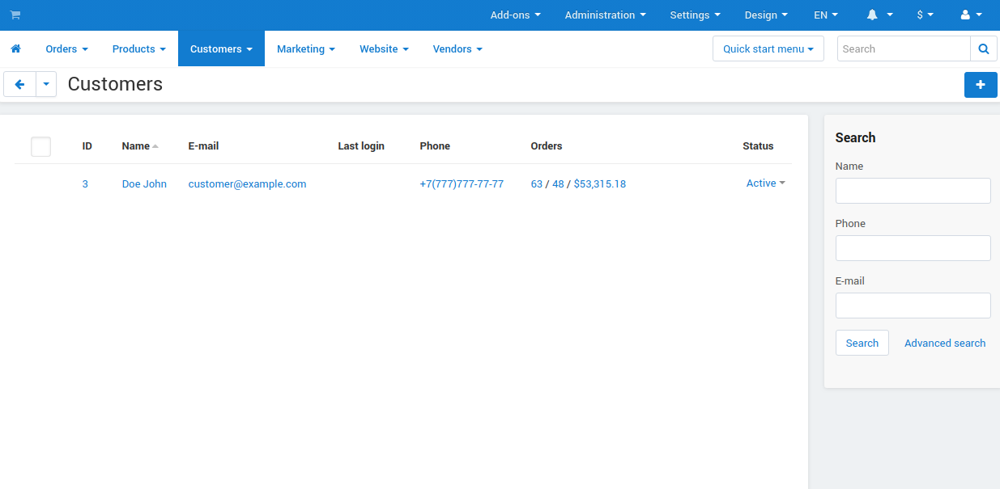

************
Пользователи
************

В меню **Покупатели** можно создавать, просматривать, редактировать и удалять учетные записи пользователей. *Учетные записи* содержат информацию о пользователях и связываюь их с заказами, подписками и т.д. 

Пользователей можно разбить по группам, чтобы задать им разные ограничения или привилегии.

.. toctree::
    :maxdepth: 2
    :titlesonly:
    :glob:

    */index

==================
Типы пользователей
==================

В CS-Cart есть следующие типы пользователей:

* **Администраторы** — могут входить в учетную запись на витрине магазина или в панели администратора. Администраторы управляют магазином. В зависимости от привилегий, они могут просматривать и/или изменять каталог магазина и другие настройки.

* **Покупатели** — могут войти в учетную запись на витрине магазина и покупать товары. Обычно для просмотра и покупки товаров на витрине не требуется учетная запись, но зарегистрированным пользователям можно дать больше возможностей. А еще зарегистрированных пользователей можно разбить по группам с разными возможностями.

* **Поставщики** — не могут входить в учетную запись. Этот тип учетных записей используется в базе данных, чтобы отметить товары, которые поставляются сторонними организациями. У разных поставщиков могут быть разные способы доставки.

  .. note::

      Поставщики появятся только если установить и включить модуль **Поставщики**. А в Multi-Vendor есть еще один тип пользователей: :doc:`администраторы продавца. <vendors/index>`
 
Форма поиска слева от списка позволяет вывести учетные записи, соответствующие определенным критериям. Если нажать на **Расширенный поиск**, то появится всплывающее окно, где будет больше критериев. 

Если приходится часто искать определенных пользователей (например, только из какой-то конкретной страны или города), рекомендуем сохранить поиск. Тогда он будет появляться рядом со списком пользователей.

===============
Список действий
===============

При наведении на учетную запись появится кнопка с изображением шестеренки. Нажав на нее, вы откроете меню со списком возможных действий (он будет разным, в зависимости от типа пользователя).

* **Посмотреть все заказы** — откроется список всех заказов, оформленных этим пользователем.

* **Действовать от лица покупателя** — откроется витрина, а вы войдете в учетную запись покупателя. Любые ваши действия на витрине будут считаться действиями, совершенными покупателем.

* **Баллы** — откроется журнал бонусных баллов покупателя.

* **Редактировать** — откроется информация об учетной записи, и ее можно будет изменить.

* **Удалить** — учетная запись будет удалена навсегда.

  .. warning::

      Удаление учетной записи отменить нельзя — восстановить запись можно будет только из резервной копии базы данных. Поэтому рекомендуем не удалять учетные записи, а отключать их.

* **Просмотреть товары поставщика** — откроется список товаров этого поставщика.

======================================
Включение и отключение учетных записей
======================================

У учетной записи есть статус: **Вкл.** или **Выкл**. Если учетная запись выключена, то пользователь не сможет в нее войти. Чтобы изменить статус учетной записи, нажмите на текущий статус и выберите другой статус из списка.

=====================
Создание пользователя
=====================

Чтобы добавить нового пользователя, нажмите кнопку **+** в правом верхнем углу страницы. Откроется форма ввода данных учетной записи.

Содержимое формы зависит от типа пользователя и от того, какие поля профиля заданы в меню **Администрирование → Поля профиля**.

.. note::

    Адрес доставки и адрес плательщика у пользователя могут отличаться.

После создания учетной записи у нее появляются дополнительные настройки. Наведите курсор мыши на учетную запись, нажмите на кнопку с изображением шестеренки и выберите **Редактировать**:

* во вкладке **Модули** можно указать возраст пользователя (если установлен модуль **Ограничение по возрасту**);

* во вкладке **Группы пользователей** можно назначить пользователю какую-нибудь группу. Членство в группе зависит от статуса:

  * **Вкл.** — пользователь является членом группы;

  * **Неподтвержденный** — пользователь подал заявку на вступление в группу, и заявка ожидает решения администраторов.

  * **Доступно** — пользователь может подать заявку на вступление в группу.

  * **Отклонен** — заявка пользователя на вступление в группу была отклонена.
