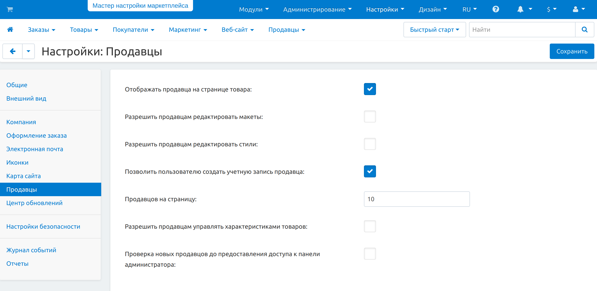
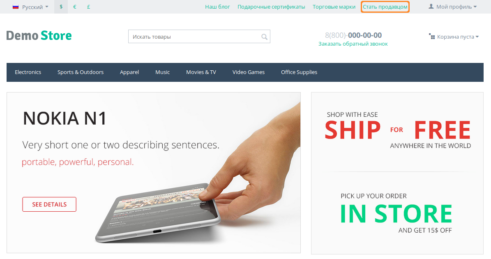
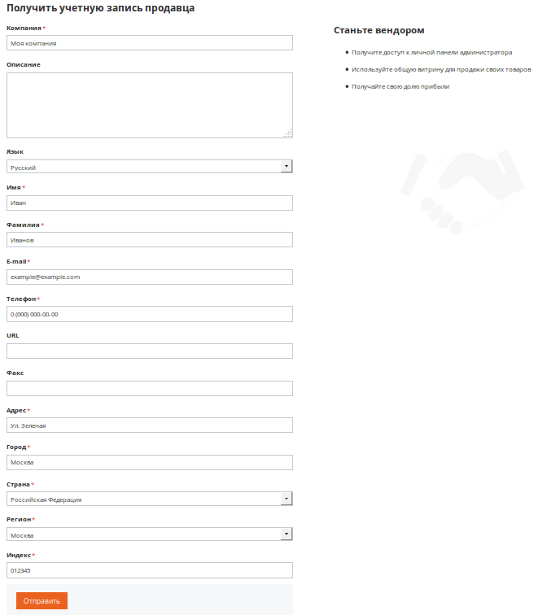
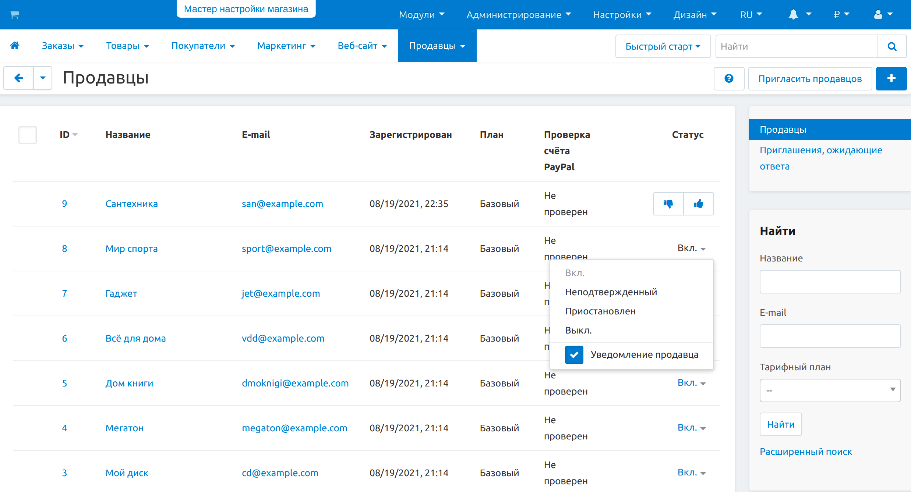

************************************************
Как разрешить покупателям становиться продавцами
************************************************

.. important::

    **Продавцы** есть только в **Multi-Vendor**.

===========================================================
Шаг 1. Разрешим покупателям создать учетную запись продавца
===========================================================

1.1. Откройте страницу **Настройки → Продавцы** в панели администратора Multi-Vendor.

1.2. Поставьте галочку **Позволить пользователю создать учетную запись продавца**.

1.3. Если нужно, разрешите автоматическое создание учетных записей администраторов для одобренных продавцов.

1.4. Если нужно, укажите, что пользователи должны согласиться с условиями использования сайта при подаче заявки.

     .. note::

         Текст условий хранится в языковой переменной ``vendor_terms_n_conditions_content``. Подробнее о языковых переменных можно узнать :doc:`в этой статье. <../../look_and_feel/languages/translate>`

1.5. Нажмите кнопку **Сохранить**.

==============================================
Шаг 2. Дадим ссылку на форму создания продавца
==============================================

После **шага 1** форма создания продавца будет доступна по ссылке вида *http://example.com/index.php?dispatch=companies.apply_for_vendor*. Вам останется только подставить свой сайт вместо *http://example.com*. 

Но есть и другие способы дать покупателям ссылку на форму. Например, в демо-данных Multi-Vendor есть меню **Быстрые ссылки** с элементом **Стать продавцом**.

Вы можете создать свой элемент меню, который будет вести на страницу с формой. Значение URL у элемента меню должно быть таким: ``dispatch=companies.apply_for_vendor``.

.. hint::

    :doc:`В этой статье <../../look_and_feel/menus/index>` описано, как работать с меню и элементами меню.

После того, как покупатель заполнит и отправить форму, администратор магазина сможет одобрить нового продавца.

===============================
Шаг 3. Одобряем нового продавца
===============================

3.1. Откройте страницу **Продавцы → Продавцы**.

3.2. Найдите продавца, которого нужно одобрить.

     .. hint::

         У таких продавцов стоит статус **Новый**.

3.3. Измените статус продавца на **Вкл**.

   .. hint::

       Подробнее о статусах продавцов читайте :doc:`в соответствующей статье. <vendor_statuses>`

