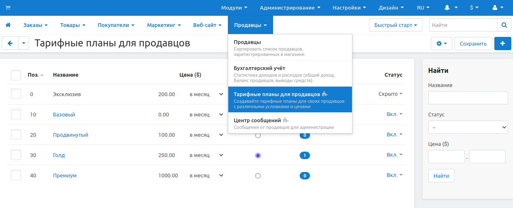

******************************************
Управление тарифными планами для продавцов
******************************************

.. note::

    Этот функционал впервые появился в **Multi-Vendor 4.4.1** как часть модуля :doc:`Тарифные планы для продавцов </user_guide/addons/vendor_plans/index>`.

Тарифные планы позволяют вам выставить условия для продавцов, которые продают товары в вашем магазине. Например, вы можете уточнить, какой процент продавцы должны вам выплачивать, как часто, какими категориями могут пользоваться и так далее.

Для управления тарифными планами, перейдите к **Продавцы → Тарифные планы для продавцов** в панели администрирования вашего магазина. Всё, что описано ниже, происходит на этой странице.

.. note::

    Чтобы увидеть, как всё будет выглядеть для покупателя, нажмите на иконку **с шестерёнкой** в верхнем правом углу и нажмите **Предпросмотр**.

.. contents::
   :backlinks: none
   :local:

======================================
Добавить/Отредактировать тарифный план
======================================

#. Чтобы добавить план, нажмите на кнопку **+** в верхнем правом углу страницы. Чтобы отредактировать план, нажмите на его название в списке.

#. Откроется всплывающее окошко с несколькими вкладками. Настройка свойств плана выглядит следующим образом:

   **Общее:**

   * **Название**—название плана в том виде, в каком оно отображается на панели администрирования и на витрине магазина.

   * **Предложить в качестве лучшего выбора**—поставьте галочку чтобы выделить план среди прочих. Строка *"Лучший выбор!"* появится над названием плана

   * **Описание**—краткое описание плана, которое появится над названием плана. Будет лучше всего, если вы ограничите его фразой или коротким предложением.
 
   * **Позиция**—расположение плана относительно других планов как на витрине магазина, так и на панели администрирования.

   * **Статус**—Один из трёх возможных статусов плана:

     * *Вкл*—план виден на витрине и в панели администрирования.

     * *Скрыто*—план виден только подписанным на него продавцам. Другие не могут его видеть

     * *Выкл*—план не видим продавцам и не может быть ими использован. План можно отключить только если им никто не пользуется.

     .. note::

         Видимость планов также зависит от того, разрешаете ли вы :doc:`продавцам переходить на другие планы </user_guide/addons/vendor_plans/vendor_plans_settings>`.

   .. image:: img/new_plan_general.png
       :align: center
       :alt: Вкладка "общее" тарифного плана.

   **Комиссия:**

   * **Цена**—определяет, сколько и как часто продавец должен платить за использование этого плана.

   * **Плата за транзакцию**—комиссия с продаж, которую продавец должен заплатить владельцу магазина.

     .. note::

         Дополнение :doc:`Планы для продавцов: комиссия по категории /user_guide/addons/commissions_by_category/index` позволяет установить комиссии, которые зависят от основной категории продукта.

   .. image:: img/new_plan_commission.png
         :align: center
         :alt: Вкладка "Комиссия" тарифного плана.

   **Условия:**

   * **Макс. число товаров**—максимальное количество товаров, которое поставщик может иметь в этом плане за один раз. Это включает в себя все продукты, независимо от их статуса. Чтобы разрешить неограниченное количество товаров, оставьте это поле пустым.

   * **Порог выручки**—максимальная сумма дохода, которую продавец может получить в месяц. Чтобы предложить неограниченный доход, оставьте поле пустым.

     .. important::

         Когда у продавца будет больший доход, чем разрешено планом, будет отправлено электронное письмо, чтобы уведомить об этом владельца магазина. Продавец все еще может продолжать работать в обычном режиме, окончательное решение остаётся за владельцем магазина.

   * **Микромагазин продавца**—поставьте галочку, чтобы продавцы могли иметь микромагазин. Это раздел магазина, в который входят только товары, категории и фильтры определенного поставщика. Поиск в этом разделе также ограничен товарами конкретного поставщика.

   .. image:: img/new_plan_restrictions.png
        :align: center
        :alt: Вкладка "Условия" тарифного плана.

   **Категории:** создайте список категорий, в которые продавцы могут добавлять свои продукты. По умолчанию доступны все категории.

   .. image:: img/new_plan_categories.png
       :align: center
       :alt: Вкладка "Категории" тарифного плана.

   .. hint::

       Узнайте больше о продавцах и категориях в :doc:`отдельной статье. <vendor_categories>`

#. Нажмите на кнопку **Создать** или **Сохранить**.

=================================
Удаление тарифного плана продавца
=================================

* Чтобы удалить один план, нажмите на кнопку с  **шестеренкой** в строке плана и нажмите **Удалить**.

* Чтобы удалить несколько:

  #. Отметьте галочками планы, которые вы хотите удалить.

  #. Нажмите на кнопку с **шестеренкой** в верхнем правом углу.

  #. Выберите **удалить выделенное**.

  .. important::

      План не будет удалён если хотя бы один продавец его использует.

.. _switch-between-vendor-plans:

==========================
Переключение между планами
==========================

#. В панели администрирования перейдите к **Продавцы → Продавцы**.

#. Нажмите на имени нужного продавца.

#. Перейдите на вкладку **Тарифные планы**.

#. Выберите необходимый план.

   * Администраторы магазина видят выпадающий список со всеми *Активными* и *Скрытыми* планами, которые есть в магазине.

   * Администраторы продавца видят все *Активные* планы (и *Скрытые* планы тоже, если они используются поставщиком) с их ограничениями и ценами, как, например, при :doc:`подаче заявки на учетную запись продавца. <allow_customers_to_apply_for_vendor_account>`

     .. important::

         Администраторы продавца могут переносить своих поставщиков на другие планы, только если это разрешено в :doc:`настройках модуля "Тарифные планы для продавцов". </user_guide/addons/vendor_plans/vendor_plans_settings>` Otherwise they will only see their own plan.

#. Нажмите на кнопку **Сохранить** в верхнем правом углу. После этого оплата за тарифный план будет списана с баланса продавца.

.. note::

    Продавцы получат специальное :doc:`уведомление на электронную почту </user_guide/look_and_feel/email_templates/index>` о том, то они перешли на другой тарифный план.

.. image:: img/vendor_selects_plan.png
     :align: center
     :alt: Список планов которые могут быть выбраны.
