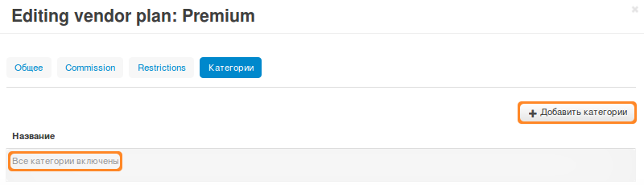

********************
Продавцы и категории
********************

.. important::

    **Продавцы** есть только в **Multi-Vendor**.

По умолчанию, продавцы могут создавать товары во всех категориях. Однако можно разрешить продавцам создавать товары только в определенных категориях.

.. note::

    Начиная с **Multi-Vendor 4.4.1**, категории, доступные продавцам, зависят от их плана (модуль **Vendor plans**).

====================================
Меняем категории, доступные продавцу
====================================

1. Откройте страницу **Продавцы → Vendor plans** в панели администратора Multi-Vendor.

2. Нажмите на название плана, который хотите изменить.

3. Перейдите на вкладку **Категории**.

4. Добавляйте категории, которые должны быть доступны продавцу, кнопкой **Добавить категории**.

5. Нажмите кнопку **Сохранить**.

.. important::

    Если в списке нет ни одной категории, то продавцы, использующие этот план, смогут размещать товары во всех категориях.

=========================================
Категории на странице продавца на витрине
=========================================

На витрине магазина Multi-Vendor у продавца может быть своя страница, где будут отображаться только товары этого продавца. На этой странице будут показаны только те категории, в которых у продавца есть товары.

.. important::

    Категория появится даже в том случае, если в ней есть только выключенные или скрытые товары. Чтобы избежать этого, рекомендуем переносить выключенные и скрытые товары в специальную выключенную/скрытую категорию.
