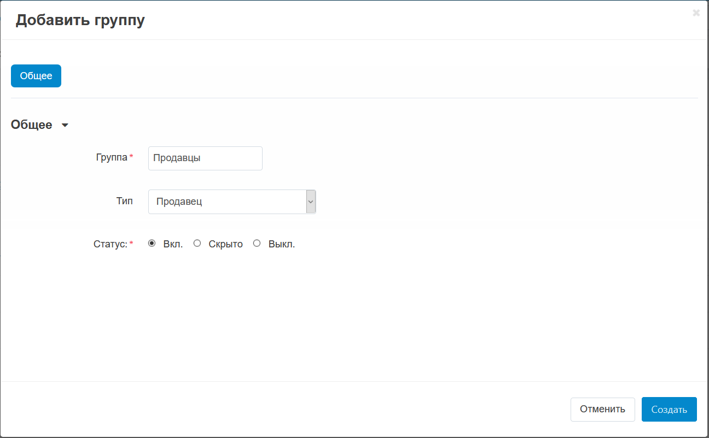
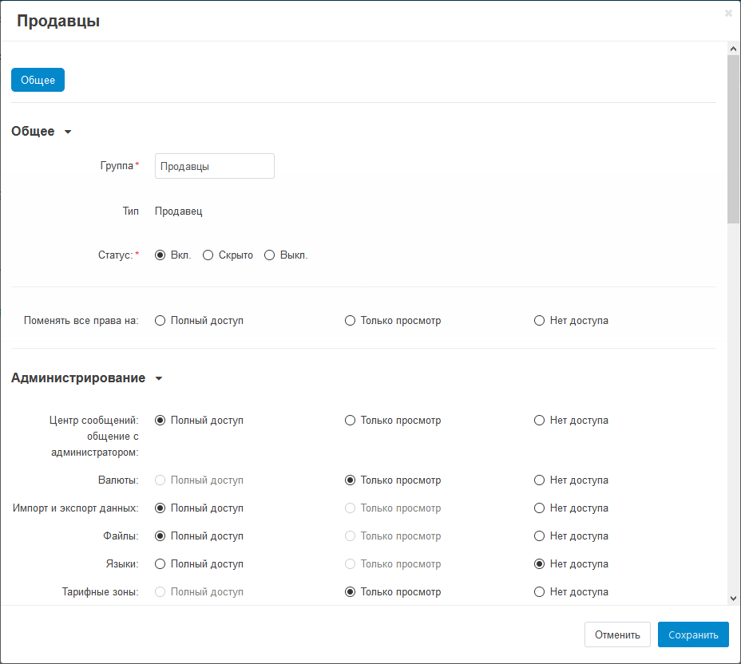
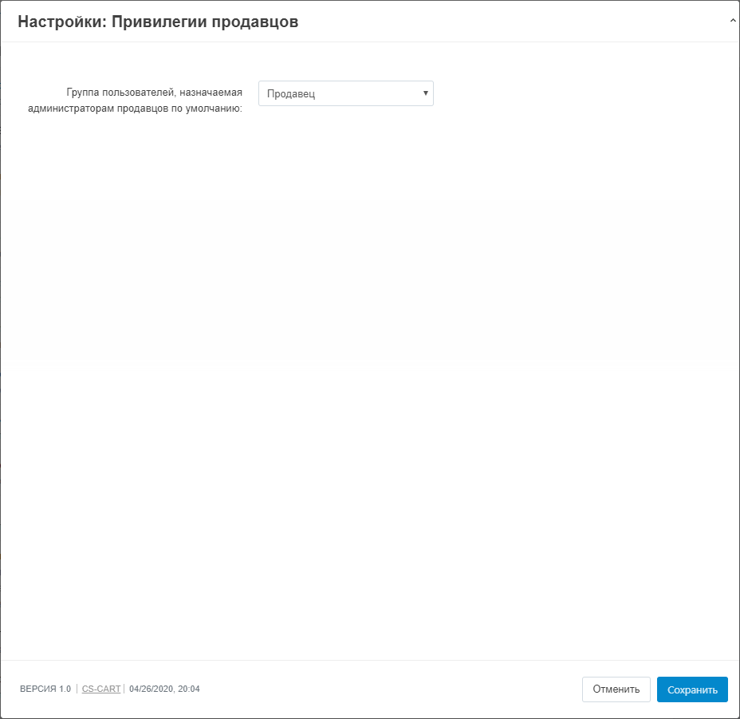
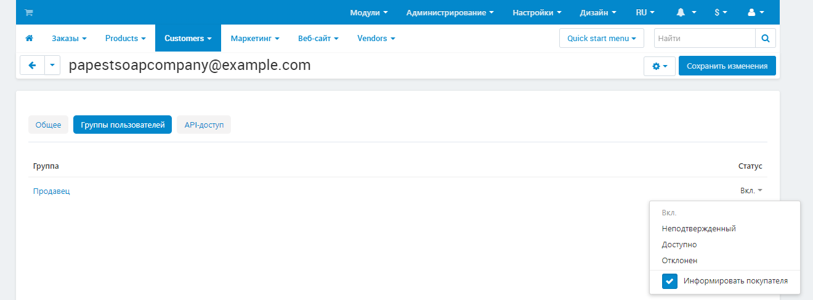

********************************************************************
Как создать новую группу пользователей для администраторов продавцов
********************************************************************

.. note::

    Этот функционал доступен только в Multi-Vendor Plus как часть модуля :doc:`/user_guide/addons/vendor_privileges/index`.

Владельцы магазинов могут управлять тем, что :doc:`администраторы продавцов </user_guide/users/vendors/index>` могут делать в своих администраторских панелях. С этой целью они могут:

* Создавать группы пользователей с ограниченными правами для администраторов продавцов.

* Задавать группу пользователей по умолчанию, куда будут попадать все вновь прибывшие продавцы.

  .. hint::

      Эти изменения не коснутся текущих администраторов. Вы можете задавать для них группы пользователей вручную при необходимости. Для этих целей пункт 3 в инструкции является необязательным.

===========================================================
Шаг 0. Убедитесь, что модуль "Привилегии продавцов" активен
===========================================================

По умолчанию, в Multi-Vendor нет пользовательских групп для администраторов продавцов. Этот функционал доступен только в Multi-Vendor Plus и только если активен модуль **Привилегии продавцов** . :doc:`Статья о данном модуле </user_guide/addons/vendor_privileges/index>` объясняет, что делает модуль и как его настроить.

====================================
Шаг 1. Создание группы пользователей
====================================

1.1. В Панели администратора перейдите к **Клиенты → Группы пользователей**.

1.2. Нажмите на кнопку **+** в правом верхнем углу.

1.3. Введите имя новой группы пользователей в поле **Группа**.

1.4. Установите **Тип** на *Продавец*.

1.5. Установите **Статус** группы: **Вкл** - группа активна; **Скрыто** - назначать членов группы может только администратор; **Выкл** - группа неактивна.

1.6. Нажмите кнопку **Создать**.

    :align: center
    :alt: Уточнение имени и типа новой группы пользователей.

1.7. Откройте созданную группу.

1.8. Ниже в настройках можно поменять права группы на запись и чтение, только чтение либо отключить группе доступ.

1.9. Права группы по отдельным пунктам выбираются ниже.

1.10. Нажмите кнопку **Сохранить**.

    :align: center
    :alt: Установка прав для выбранной группы.

==================================================================
Шаг 2. Установка группы по умолчанию для администраторов продавцов
==================================================================

2.1. В панели администратора зайдите в **Модули → Управление модулями**.

2.2. Найдите модуль :doc:`/user_guide/addons/vendor_privileges/index` и нажмите на его имя.

2.3. Откроются настройки модуля. Параметр **Группа пользователей, назначаемая администраторам продавцов по умолчанию** автоматически добавляет всех вновь созданных администраторов продавцов в выбранную из списка группу.

2.4. Поменяйте параметр на ваше усмотрение. Таким образом не нужно будет каждый раз вручную менять группу пользователей когда кто-нибудь создаёт администраторов продавцов.

2.5. Выбрав нужную группу пользователей, нажмите **Сохранить**.

    :align: center
    :alt: Выбор группы пользователей для вновь созданных администраторов продавцов.

=======================================================================================
Шаг 3. Добавить администратора продавцов в группу пользователей вручную (необязательно)
=======================================================================================

3.1. В панели администратора зайдите в  **Клиенты → Администраторы продавцов**.

3.2. Нажмите на нужное имя или ID чтобы открыть профиль.

3.3. Перейдите на вкладку **Группы пользователей**.

3.4. Переключите состояние только что созданной группы пользователей на **Вкл.**.

.. note::

    Только корневой администратор может назначать группы пользователей другим администраторам. Корневой администратор создаётся системой после завершения процесса установки Multi-Vendor.

    :align: center
    :alt: Добавление администратора продавцов в группу.
