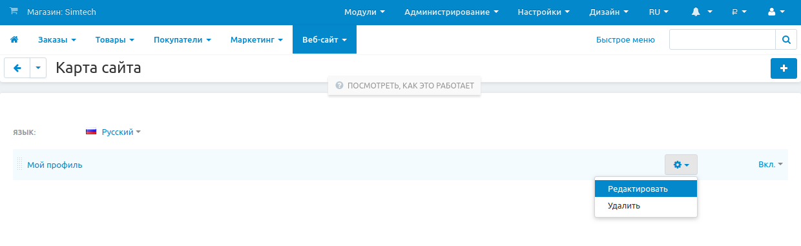
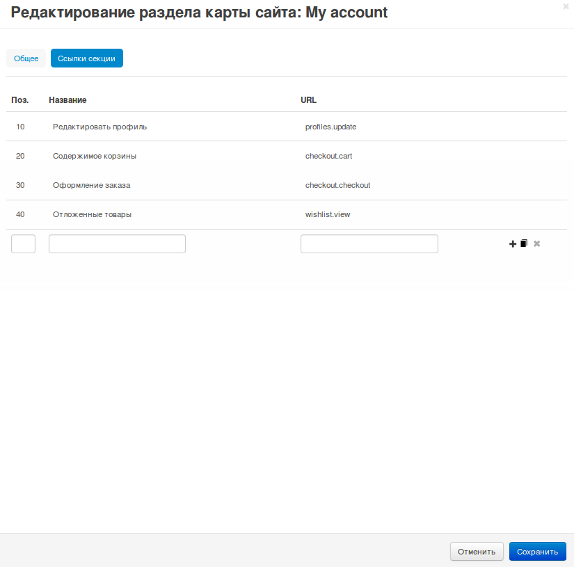

***********
Карта сайта
***********

По умолчанию на карте сайта есть ссылки на:

* информационные страницы (см. **Веб-сайт → Страницы**);

* страницы категорий (см. **Товары → Категории**). 

Добавить дополнительные страницы на карту сайта можно в панели администратора на странице **Веб-сайт → Карта сайта**. Страницы сгруппированы по разделам. Кнопка **+** в правом верхнем углу экрана добавляет разделы, а в разделах можно добавлять ссылки на конкретные страницы.

Существующие разделы редактируются и удаляются с помощью кнопок с изображением шестеренки.
 

=================
Настройки раздела
=================

---------------
Вкладка "Общее"
---------------

Здесь находятся настройки самого раздела:

* **Название** — так раздел будет называться на карте сайта.

* **Статус** — влияет на отображение раздела:

  * *Вкл.* — раздел появится на карте сайта;

  * *Выкл.* — раздел не появится на карте сайта.

-----------------------
Вкладка "Ссылки секции"
-----------------------

Здесь находятся настройки ссылок раздела:

* **Поз.** — позиция ссылки относительно других ссылок раздела.

* **Название** — текст ссылки. В таком виде ссылка появится на карте сайта.

* **URL** — адрес страницы, на которую ведет ссылка. Ссылка может быть:

  * **абсолютной** — например, ``http://example.com/index.php?dispatch=checkout.cart`` — ссылка на страницу с содержимым корзины;

  * **относительной** — например, ``dispatch=checkout.cart``.

