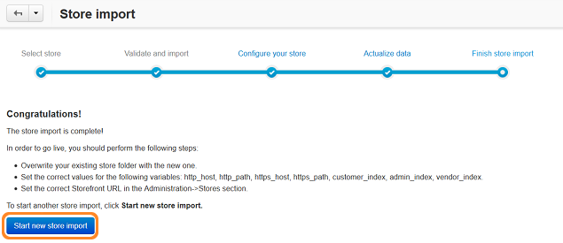

********************************************
How To: Upgrade Your Store with Store Import
********************************************

.. important::

    Before you attempt to upgrade your store, make sure you have enough space on your server hard drive.

=============================
Step 1. Install CS-Cart 4.3.x
=============================

Download CS-Cart/Multi-Vendor 4.3.1 or 4.3.2, or CS-Cart 4.3.6 and :doc:`install it <../install/index>` in a separate subdirectory of your CS-Cart/Multi-Vendor 2.2.x or 3.0.x installation. 

For example, if your original store is available at *example.com*, create the ``/store`` directory in the root of *example.com*. Then unpack the installation archive of your 4.3.x store in that directory. You should then be able to install CS-Cart/Multi-Vendor 4.3.x by using this URL: ``example.com/store``.

.. important::

    Store Import **can't** transfer data between CS-Cart and Multi-Vendor.

.. note::

    If your old store used several languages, choose the same languages for the newly installed CS-Cart 4.3.x. You can change the languages in the **Administration → Languages → Manage languages** section of the Administration panel.

============================
Step 2. Install Store Import
============================
    
2.1. Open the Administration panel **of your 4.3.x store**. 

2.2. Go to **Add-ons → Manage add-ons**.

2.3. Switch to the **Browse all available add-ons** tab.

2.4. Find **Store Import** and click the **Install** button next to it.

.. image:: img/store_import_install.png
    :align: center
    :alt: Install the Store Import add-on in your new store.

===================
Step 3. Import Data
===================

3.1. Go to **Add-ons → Store Import**. On the opened page enter the server path to the existing 2.2.4/2.2.5 or 3.0.x store. It is the path where your existing store is installed on the server. For example, on UNIX-based systems it should look something similar to */var/www/examplestore*, and on Windows it will be something like *C:/examplestore*.

3.2. Click the **Validate** button. If the path you entered was correct, the button will take you to the next step called **Validate and import**. 

.. image:: img/validate_store.png
    :align: center
    :alt: Specify the path to your old store and click the Validate button.

3.3. You will see two tables with the information about the imported store and the store where you want to import data. Press the **Import data** button to start the importing process.

.. image:: img/validate_and_import.png
    :align: center
    :alt: Once you're ready to improt the database, click the Import Data button.

3.4. You'll see the import progress bar running. The time it takes to import the data depends on the size of your database: it can take a couple of minutes or a couple of hours.

.. important::

     The add-on imports all data from 3.0.x, but doesn't import some settings and most of the layouts from 2.2.4/2.2.5. :doc:`Learn more about imported data <about_store_import>`. 

================================
Step 4. Configure Your New Store
================================

You've reached the **Configure your store** step. Now you can to leave the Store Import page and configure your new store. It can take you some time to modify the CSS styles, layouts, locations, etc. In the meantime your old CS-Cart store continues to work as usual.

.. note::

    CS-Cart users should go to **Administration → Stores**, click the name of the storefront and set the correct **Storefront URL**.

.. important::

    Don't use both the old and the new store at the same time with one license. Keep the new store closed (**Settings → General → Close storefront**) while you configure it. Close the storefront of the old store right after you go live with your new store. :doc:`Learn more about closing your storefront <../user_guide/look_and_feel/changing_attributes/store_closed>`.

.. image:: img/actualize_data.png
    :align: center
    :alt: You can leave the Store Import page and configure your store before you proceed to actualizing data.
        
======================
Step 5. Actualize Data
======================

When your new store is ready to go live, go to **Add-ons → Store Import** and click the **Proceed to actualizing data**. This step allows you import the data that accumulated in your old store while you worked on the new one.

You will see the information about the latest store import. Click the **Actualize data** button to import the data from the old store.

.. important::

    This step overwrites all the data, but doesn't import settings and layouts. If you want to exclude some other data from import, see :doc:`the corresponding article <store_import_technical_details>`.

To skip the actualization step, click the **Complete store import** button.

===============
Step 6. Go Live
===============

After the successful data import you proceed to the **Finish store import** step. Now you can use your new store live. You can always return to the **Configure your store** and **Actualize data** steps by clicking the corresponding links.

If you want to launch the import process again, click the **Start new store import** button.

