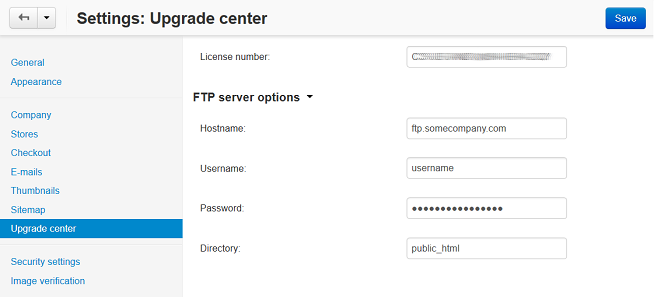
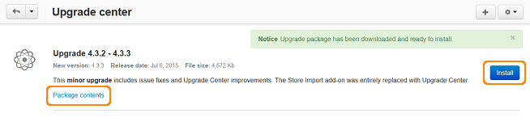

**********************************************
How To: Upgrade CS-Cart via the Upgrade Center
**********************************************

The Upgrade Center automatically retrieves information about all available updates from the CS-Cart server and displays a notification for administrator, so that they can upgrade the installed CS-Cart to the latest version.

.. note::

    If you are not familiar with technical aspects of CS-Cart and the upgrade process, you can `hire a specialist to upgrade your store <http://marketplace.cs-cart.com/developers-catalog.html?services=M>`_. You can also `ask our support team to do it for you <https://www.cs-cart.com/index.php?dispatch=communication.tickets&submit_ticket=Y>`_.

========================
Configure Upgrade Center
========================

1. Open the administration panel of your store.

2. Go to **Settings → Upgrade Center**.

3. Fill in the following fields:

* **License number**—the license key associated to your domain name. You can see it on the **Licenses** page in your `Customer Help Desk account <https://www.cs-cart.com/helpdesk>`_. You can't upgrade a store while using the trial mode.

If a web user does not have permissions to update files on your server, fill in your FTP account details:

* **Hostname**—hostname of your FTP server

* **Username**—FTP username

* **Password**—FTP password

* **Directory**—directory on the FTP server where CS-Cart is located

4. Click the **Save** button to save the changes.

===============
Upgrade CS-Cart
===============

.. note::

    Upgrading a store is a complicated process, so upgrade the test copy of your store first to make sure the upgrade will go smoothly. 

    The upgrade doesn't update third-party add-ons. That's why we recommend that you disable all the third-party add-ons before the upgrade.

1. Go to **Administration → Upgrade center**.

2. Click the **gear button** and choose **Refresh packages list** from the drop-down menu to see all upgrade packages available at the moment. In the center of the page you can see information about currently available upgrade.

.. image:: img/refresh_packages.png
    :align: center
    :alt: Refresh the packages list to see what upgrade packages are available.

3. Click the **Download** button to download the upgrade package.

4. When the package is ready to be installed, you will see the notice. If you want to look through the list of changes in the upgrade package, click the **Package contents** link.

5. Click the **Install** button to start the upgrade process.

.. important::

    :doc:`The store will be closed <../user_guide/look_and_feel/changing_attributes/store_closed>` during the upgrade process. You will need to open it after the upgrade is completed.

    Your store database and files will be backed up before the upgrade. The backup archive includes the whole database and all files, except for images. The backup archive is stored in the *var/backups* directory of your CS-Cart installation.

6. If you have any modified files that are going to be replaced with new versions, they will be displayed on the same page. These files will be backed up and you will need to :doc:`resolve conflicts after the upgrade manually <resolve_conflicts>`. Tick the **Confirm** checkbox and click the **Continue** button.

.. image:: img/modified_files.png
    :align: center
    :alt: The Upgrade Center will show the files you changed manually and back them up so that you can resolve the conflicts later.

7. If you have any files that require the *write* permissions to be set, they will be displayed at this step too. To set the permissions, click the **Auto-set permissions via FTP** button.

8. If the upgrade is successful, you will see the corresponding notification. You will also receive an e-mail with the store upgrade summary. If you cannot access your administration panel after the upgrade, use the link provided in that email to restore the latest backup.

=================
After the Upgrade
=================

After the upgrade, we recommend to check the basic functionality of your store:

* Open the storefront and look through the most important sections, like product pages, checkout, contacts, etc.

* Try to make a test purchase on behalf of a test customer.

* Check the data in the administration panel: products catalog, orders list, etc.

