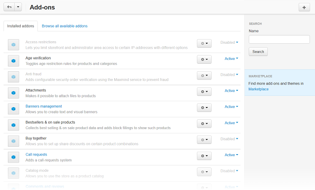
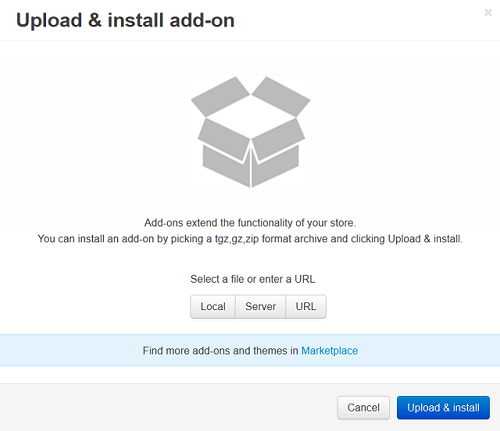

**********************
How To: Manage Add-ons
**********************

The **Addons → Manage add-ons** section contains a list of installed add-ons in the **Installed add-ons** tab, a list of add-ons available for installation in the **Browse all available add-ons tab**, and a few control elements to manage add-ons.

Enabling/disabling add-ons
**************************

To turn an add-on on or off, click on the current add-on status to expand a list of applicable statuses and select the required one.

.. image:: img/disable_addons.png
    :align: center
    :alt: Enable/Disable add-ons

Configuring add-ons
*******************

For some add-ons you can adjust specific options and preferences.

.. note ::

	Add-ons that cannot be highlighted with a mouse do not have editable parameters and cannot be configured.

To configure an add-on:

*	Click the **gear** button near the add-on status and choose **Settings**. This will open a form containing editable parameters.
*	Edit the values of the fields in the form.
*	Click **Save** to apply the changes.

Uploading add-ons from archive
******************************

To upload a new add-on:

*	Click the **+** button in the right upper corner of the page.
*	In the opened pop-up window choose whether to upload a file from the local computer (**Local**) or the server file system (**Server**). You can also specify **URL** to a remote location, where the required archive is physically located. Pay attention, that the add-on archive must be in *tgz*, *gz* or *zip* format.
*	Click **Upload & install**.

    
.. important ::

	Before uploading an add-on from archive make sure that there is no such an add-on among the modules available for installation in the **Browse all available add-ons** tab.