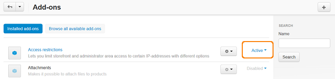
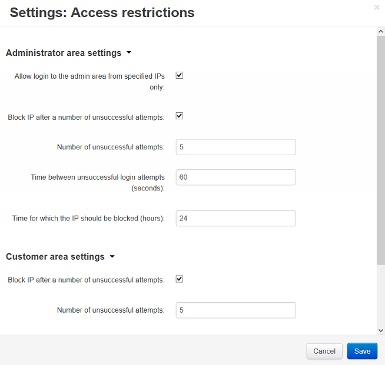

***********************************************
How To: Restrict Access to Administartion Panel
***********************************************

*   In the Administration panel, go to **Add-ons → Manage add-ons**.
*   Enable the **Access restrictions** add-on in the **Installed add-ons** tab (change its status to *Active*). 

.. note ::

	If you do not see the add-on in the **Installed add-ons** tab, install it in the **Browse all available add-ons** tab first.

*   Click on the name of the add-on.
*   Tick the **Allow login to the admin area from specified IPs only** check box in the **Administrator area settings** section and click **Save**.

    To specify the IPs:

    *   Refresh the page after activating the add-on and go to **Add-ons → Access restrictions**. Open the **Administration panel** tab.
    *   Click the **+** button on the right to add IPs.
    *   In the **IP from** and **IP to** fields enter the first and the last IP addresses of the interval of IPs, for which access to the administration panel will be allowed.

        .. important ::

        	The administrator IP is saved automatically in the **Administration panel** section.

*   Go to **Add-ons → Manage add-ons** and click on the name of the **Access restrictions** add-on to continue its editing.
*   **Block IP after a number of unsuccessful attempts** — tick if you want to deny any further attempts to log in.

    .. note ::

    	The number of possible attempts should be specified below and the attempts have to be made within the period set in the **Time between unsuccessful login attempts** field.

*   **Number of unsuccessful attempts** — define how many unsuccessful attempts to login can be made before user's IP address will be blocked.
*   **Time between unsuccessful login attempts** — specify the period within which attempts to log in can be made.
*   **Time for which the IP should be blocked** — specify how long the IP address will be blocked after unsuccessful attempts to log in.
*   Click **Save**.

