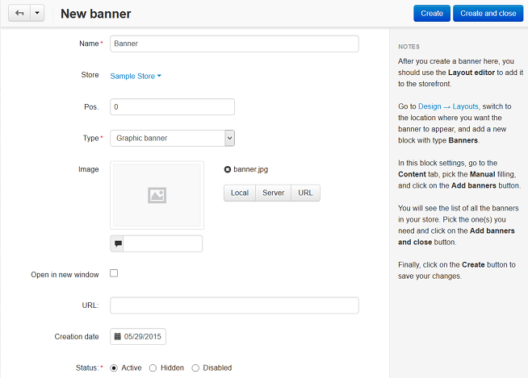
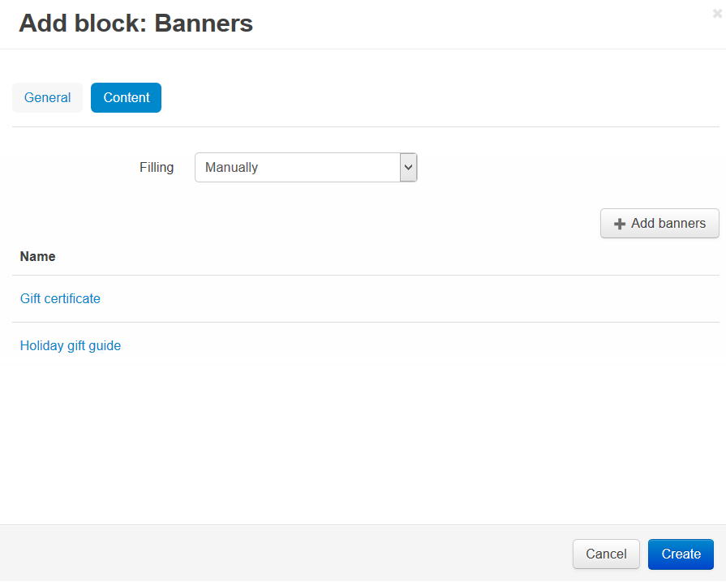

**************************************
How To: Add a Banner to the Storefront
**************************************

To create a text or graphic banner:

*   In the Administration panel, go to **Marketing → Banners**.

.. note ::

	If there is no such section, make sure that the **Banners management** add-on has the Active status in the **Add-ons → Manage add-ons** section.

*   Click the **+** button on the right.
*   On the opened page in the **Name** input field type the name of the new banner.
*	In the **Type** select box select *Text banner* or *Graphic banner*:

	*   For *Text banner* in the **Description** field type the description of the banner.
	*	For *Graphic banner* upload an image and choose whether to display the banner in new window.

*   Click **Create**.

To add a banner to your store pages:

*   Go to **Design → Layouts**.
*   Select the layout page for your banner, i.e. open the corresponding tab at the top. For example, open the **Cart** layout page, if you want the banner to be displayed on the Cart page.
*   In the container, where you want to place the new banner, click the **+** button and choose **Add block**. Open the **Create New Block** tab and choose **Banners**.
*   In the **Name** input field type the name of the block (e.g., *My banner*).

.. image:: img/add_banner_02.png
	:align: center
	:alt: General

*   Open the **Content** tab, in the **Filling** select box select *Manually*, and click the **Add banners** button to add banners.

*   Click **Create**.

.. important ::

	After the block is created or changed, make sure it is displayed correctly. Not all wrappers are suitable for the blocks.

.. note ::

	In the described example the banner will be displayed on the **Cart contents** page in the storefront.