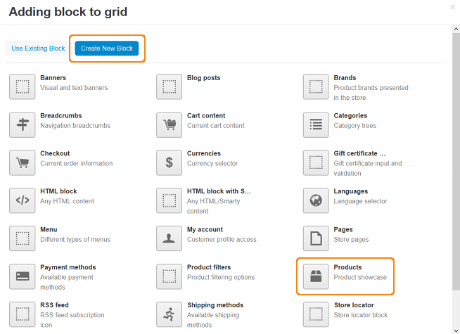
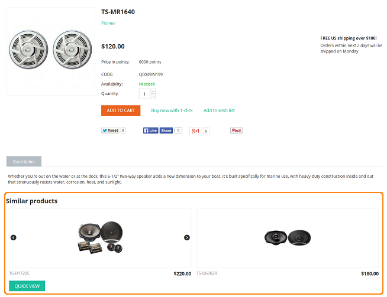

**********************************************************
How To: Display Similar Products on a Product Details Page
**********************************************************

To add the **Similar** section to the product details pages:

*   In the Administration panel, go to **Design > Layouts** and open the **Products** tab.
*   Click the **+** icon in the desired container and choose **Add block**.

.. image:: img/similar_01.png
	:align: center
	:alt: Add new block

*   Switch to the **Create New Block** tab and select a **Products** block.

*   Name the block. In the **Template** field choose the way to display the products list.
*   Switch to the **Content** tab and choose the *Similar* block filling in the **Filling** select box.
*   Optionaly, you can define the price range for similar products in the **Price range** field. You can also make a list of similar products of the same category, including or excluding subcategories. To exclude out-of-stock products from the list, check the **Only “in stock” products** box.
*   Click the **Create** button.

