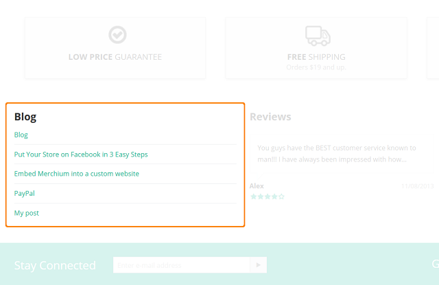

******************************************************
How To: Add the Recent Posts Section to the Storefront
******************************************************

To add the **Recent posts** section to the storefront:

.. important ::

	Make sure that the **Blog** add-on is enabled in your store, and there are some blog posts created in the **Website → Blog** section.

*   In the Administration panel of your store, go to **Design → Layouts** and choose a layout page, *Homepage*, for example.
*   In the desired container click the **+** icon and choose **Add block**.
*   In the opened window switch to the **Create New Block** tab and click the **Recent posts** button.
*   Name a block, choose a template, and customize other settings.
*   Click the **Create** button. A block with links to your latest blog posts is now added to the storefront.

