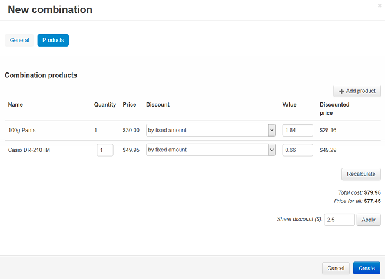

**************************************
How To: Set up the Buy Together Add-on
**************************************

To set up the **Buy together** add-on:

*   In the Administration panel, go to **Add-ons > Manage add-ons**.
*   Find the **Buy together** add-on in the **Installed add-ons** tab and change its status to *Active*.

.. note ::

	If you do not see this add-on, switch to the **Browse all available add-ons** tab, find the **Buy together** add-on, and click the **Install** button next to its name.

To add the buy together products for a product:

*   Go to **Products > Products**.
*   Find the product for which you want to show products that are bought with it and click on its name.
*   Switch to the **Buy together** tab.
*   Click the **Add combination** button.
*   In the **Name** unput field type the name of the new combination, type the **Description** if you want to, define the time period in the **Available from**, **Available till** fields, and tick the **Display in promotions** checkbox if necessary.

.. image:: img/buy_together_01.png
	:align: center
	:alt: New combination

*   Open the **Products** tab. Click the **Add product** button.
*   Select the product(s) you want to add to the main product for the **Buy together** option and click the **Add products and close** button.

.. image:: img/buy_together_02.png
	:align: center
	:alt: Add products

*   Define the **Quantity**, **Discount**, and **Value** parameters.
*   Click the **Recalculate** button on the right side of the page, set the discount value in the **Share discount($)** field, and click **Apply**.

*   Click **Create**.