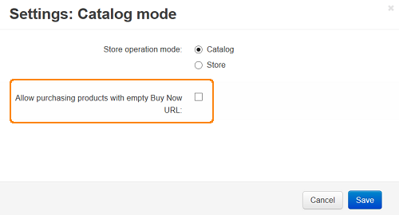
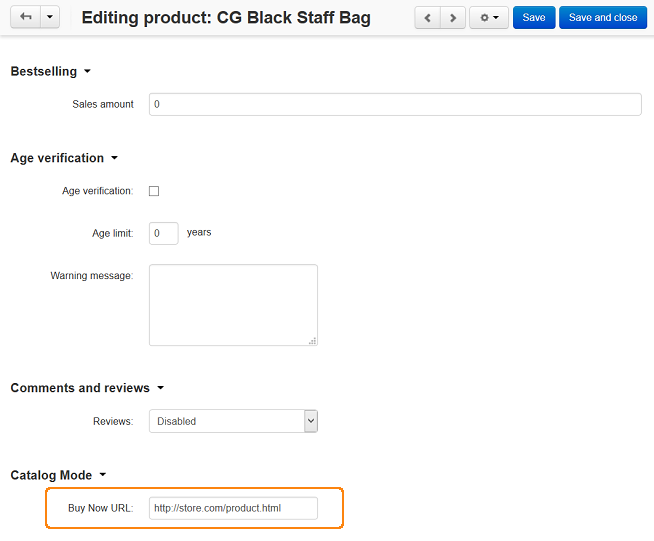

**************************************
How To: Set up the Catalog Mode Add-on
**************************************

The purpose of the **Catalog mode** add-on is to advertise products.

To set up the **Catalog Mode** add-on:

*   In the Administration panel, go to **Add-ons → Manage add-ons**.
*   Change the status of the **Catalog mode** add-on to *Active* in the **Installed add-ons** tab.

.. note ::

	If you do not see this add-on, switch to the **Browse all available add-ons** tab, find the add-on, and click the **Install** button.

To allow customers only view products without purchasing them:

*	Go to **Add-ons → Manage add-ons** and click on the name of the **Catalog mode** add-on.
*   Untick the **Allow purchasing products with empty Buy Now URL** check box.
*   Click **Save**.

.. important ::

	If the **Allow purchasing products with empty Buy Now URL** check box is ticked, the administrator will be able to sell products.

To redirect customers to the site of administrator's partner, when a customer decides to purchase a product:

*	Go to **Products → Products** and click on product name. 
*   Open the **Add-ons** tab.
*   In the **Catalog mode** section in the **Buy Now URL** input field enter the URL of the partner's site.
*   Click the **Save** or **Save and close** button.

.. note ::

	These products will have the **Buy now** button instead of the **Add to cart** one. When a customer clicks on it, he/she will be redirected to the URL that is specified by administrator (e.g., the product detail page of your partner's store).

.. important ::

    If the **Catalog Mode** add-on is enabled, the **Buy Together** and **Gift Certificates** add-ons will not be able to work correctly in the catalog mode. They will be disabled automatically.